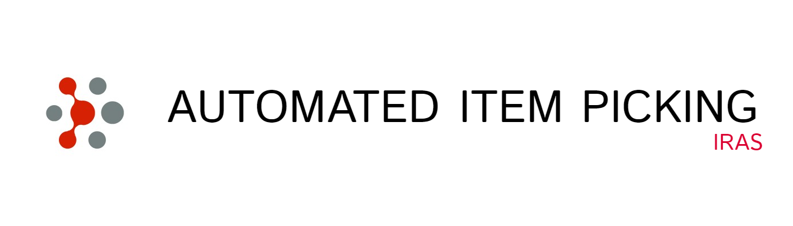

# Automated Item Picking - Wiki

This repository is intended to be a wiki for the Automated Item Picking project of the iRAS at the University of Applied Sciences in Karlsruhe.

Automated Item Picking (short: AIP) describes the challenge of an automated detection and grippig of objects. A series of interlinked process steps are required to perform this task.
The main components of the AIP are object recognition, gripping point planning, gripping technology, motion planning and communication or control.

## System overview

- [System overview](/docs/system_overview.md)
- [Repository overview](/docs/overview_repository.md)

## How To AIP

- [How to setup laboratory pc](/docs/how_to_setup_laboratory_pc.md)
- [How to use KUKA SmartPad](/docs/how_to_use_kuka_hmi.md)
- [How to start AIP](/docs/how_to_start_aip.md)
- [How to configure robot control](/docs/how_to_configure_robot_control.md)
- [How to configure PLC](/docs/how_to_configure_plc.md)
- [Cheatsheet terminal commands](/docs/cheatsheet_terminal.md)

## Parameters

- [Devices, IPs and passwords](/docs/devices_ips_and_passwords.md)
- [IO Mapping KUKA](/docs/mapping_hw_to_io_number.md)
- [URDF files](/docs/urdf_files.md)

## MS Teams

[AIP MS Teams Team](https://hskarlsruhede.sharepoint.com/:f:/s/Robolab/EqgV9DKqqRJDrYVzu5INeNgBFf0JPXn-Eccabwk7Z6qXew?e=pYTAJ6)

If you are not yet part of the iRAS Students MS team, you can ask any member of the IRAS Institute to invite you to join the team.

## Components

- [How to configure Sick LiDAR scanner](/docs/how_to_configure_sick_scanner.md)
- [How to connect to Moneo](/docs/how_to_connect_to_Moneo.md)

## Troubleshooting

- [Troubleshooting](/docs/troubleshooting.md)
