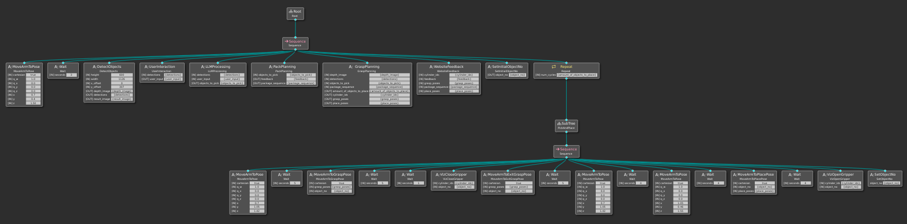

# AIP Coordinator 

This repository contains the high level task control for the AIP application implemented with the Behavior Tree package in C++.

It uses the [BehaviorTee.IRAS](https://github.com/AndreasZachariae/BehaviorTree.IRAS) framework which is a wrapper around the [BehaviorTree.cpp v3.8](https://www.behaviortree.dev/) library and extends it for the combined use of behavior trees with ROS 2 Humble.

The library of actions can be arranged freely with the graphical user interface [Groot](https://github.com/BehaviorTree/Groot).

This ReadMe covers the following topics: 
1. Application Behavior Tree
2. How to start a Behavior Tree? 
3. How to start the Groot editor?
4. How to design a new Behavior Tree?
5. How to create a custom node?
6. Interfaces
7. Further information (including the usage of custom interfaces)

Please consider that the interfaces from other external packages are only visible within the docker as defined in the Dockerfile.
For further development, make sure to rebuild the image and update the interfaces if changes to the interfaces are required and implemented in the individual repositories of the application parts (e.g. aip_packing_algorithm or aip_grasp_planning)

## 1. Application Behavior Tree

The current application (SS2024) uses the following behavior tree: 

<br>

It uses regular service clients, (shared) blackboards, decorators, subtrees and standalone BT nodes to perform simple tasks.

The first part uses common service clients for:
- Object Detection
- User Interaction
- LLM Processing
- Pack Planning
- Grasp Planning 

Afterwards it uses a subtree to execute the pick and place sequence consisting of: 
- Move to a waypoint close to the picking area 
- Move to the grasp pose 
- Visualize Gripper Movement in RViz 
- Close gripper and vacuum hold the package 
- Move to exit grasp pose shifted in z-height 
- Move to a waypoint close to the place Area
- Move to the place pose 
- Visualize Gripper Movement in RViz 
- Open gripper to detach the package
- Set object number 

The subtree is able to flexibly adapt to the amount of objects to be handled.  
This is implemented by using a the "Repeat" decorator for the {amount_of_objects_to_place}, which is an output port of the grasp planning.    
Before the subtree starts, the initial object number must be set to zero as a blackboard variable {object_no}, which is done by the "SetInitialObjectNo" node.    
At the end of each pick and place sequence, the {object_no} is incremented by the "SetObjectNo" node until the number of cycles defined in the "Repeat" decorator node is reached. 


## 2. How to start a Behavior Tree?

Build and start the docker container
```bash
source build_docker.sh
source start_docker.sh
```

Inside the container launch the Coordinator node with parameters:
```
ros2 launch aip_coordinator <launchfile_name>.launch.py
```
```
ros2 launch aip_coordinator aip.launch.py
```

The to be executed Behavior Tree can be adjusted in the corresponding launch file (e.g. aip.launch.py) located in 'src/aip_coordinator/launch'. In order to change it to an other behavior XML File, please adapt the parameters=[{'main_tree_path: ...<file path to the behavior file>......}]. 
Alternatively, you can us the params.yaml file. 

Behavior Trees can be arranged in a hierarchical order and use the so-called Blackboard to share variables and information. 
The Blackboard can be isolated per Subtree or opened for other parts of the sequence control. 
It enables to build modular and flexible Behavior Trees for new applications. 

The Behavior Tree for aip.launch.py in the project from the SS2024 does include Subtrees and benefits from using the Blackboard to communicate between different parts of the application. 


## 3. How to start the Groot editor?

You can start Groot as the graphical user interface for the Behavior Tree.

Attach to a new shell and start groot:

```bash
docker exec -it coordinator bash
ros2 run groot Groot
```

## 4. How to design a new Behavior Trees?


1. Start the docker container
    ```bash
    source start_docker.sh
    ```
2. If new BT nodes were added or ports changed, regenerate the GrootPalette by starting a test BT.
   ```bash
   # in ~/ros2_ws/
   colcon build && source install/setup.bash
   ros2 launch aip_coordinator aip.launch.py
   ```
3. Alternatively: Start Groot in Editor mode
    ```bash
    ros2 run groot Groot
    # Click "Editor" and "START"
    ```
4. Load GrootPalette with all custom nodes.  
   Click on ->   to load palette from file.  
   Choose the file from: `/home/docker/ros2_ws/src/aip_coordinator/behaviors/GrootPalette.xml`
5. Build BT via drag and drop
6. Save tree to file.  
   Click on ->   to save.  
   Choose location as: `/home/docker/ros2_ws/src/aip_coordinator/behaviors/<your_folder_name>/`
7. Create a new launch file with this parameter or adjust a existing launch file with this parameter:
    ```python
    # in /home/docker/ros2_ws/src/aip_coordinator/launch/<your_launch_file>.launch.py>
    parameters=[{'main_tree_path': "/home/docker/ros2_ws/src/aip_coordinator/behaviors/<your_folder_name>/<your_tree_name>.xml",
                 'groot_palette_path': "/home/docker/ros2_ws/src/aip_coordinator/behaviors/GrootPalette.xml"}],
    ```
8. Launch your node 

Alternatively, you can adjust the .xml files diretly. 
- GrootPalette.xml 
- <Behavior>.xml including the loaded Groot Palette at the bottom of the BT-Sequences


## 5.How to create a new custom node

There are currently 4 different types of nodes supported:
- **actions** Use for ROS2 action client
- **services** Use for ROS2 service client
- **conditions** Use for classic BT condition with ROS2 node handle access
- **nodes** Use for classic BT action with ROS2 node handle access

This instructions gives an example for a ROS2 action client

1. Add a new header file in the corresponding folder at `aip_coordinator/include/aip_coordinator/actions`. For this, copy an existing file from that folder and rename. Use this structure as template. Copy `MoveBase.h` and rename to `MyCustomActionNode.h`.
2. Add a new source file in `aip_coordinator/src/actions`. Copy `MoveBase.cpp` and rename to `MyCustomActionNode.cpp`.
3. In this source file change the first line to include your newly added header.  
   Replace: ~~`#include <aip_coordinator/actions/MoveBase.h>`~~
    ```cpp
    // in MyCustomActionNode.cpp
    #include <aip_coordinator/actions/MyCustomActionNode.h>
    ```
4. In your header file `MyCustomActionNode.h` include the header files of your ROS2 interface you want to use. In this example it is located in the `_interfaces` package.  
Replace: ~~`#include <nav2_msgs/action/navigate_to_pose.hpp>`~~  
**Important**: Interface header files are generated automatically. If your Interface file is called `MyCustomAction.action` (PascalCase) the generated header will be `my_custom_action.hpp` (snake_case).
    ```cpp
    // in MyCustomActionNode.h
    #include <aip_interfaces/action/my_custom_action.hpp>
    ```
5. Give an alias as shorter name.  
Replace: ~~`using NavigateToPoseAction = nav2_msgs::action::NavigateToPose;`~~
    ```cpp
    // in MyCustomActionNode.h
    using MyCustomAction = aip_interfaces::action::MyCustomAction;
    ```
6. Replace all occurences where old alias is used with new one in `.ccp` and `.h` file. Use VSCode find and replace (strg + f) or rename symbol (F2) shortcut.
7. Change the class name to the same name as the file.  
   Replace: ~~`class MoveArm : public RosAction<MoveArmMoveIt>`~~  
   **Important**: The class name must be different from the given alias.
    ```cpp
    // in MyCustomActionNode.h
    class MyCustomActionNode : public RosAction<MyCustomAction>
    ```
8. Replace all occurences of the old class name in the source file `.ccp` with new one. Use VSCode find and replace (strg + f) or rename symbol (F2) shortcut.  
   Replace: For every function: ~~`std::string MoveBase::ros2_action_name()`~~
    ```cpp
    // in MyCustomActionNode.cpp
    // for every function
    std::string MyCustomActionNode::ros2_action_name()
    /* ... */
    ```
9. Set the topic name of the ROS2 action server to connect with as string.
    ```cpp
    // in MyCustomActionNode.cpp
    std::string MyCustomActionNode::ros2_action_name()
    {
        return "my_custom_action_topic";
    }
    ```
10. Set the list of ports provided by the BT node.
    ```cpp
    // in MyCustomActionNode.cpp

    /* New port:
    *      direction = [BT::InputPort, BT::OutputPort, BT::BidirectionalPort]
    *      data_type = <[float, int, std::string]>
    *      name = ("name") */
    BT::PortsList MyCustomActionNode::providedPorts()
    {
        return {BT::InputPort<std::string>("string_input"),
                BT::OutputPort<float>("float_output"),
                BT::BidirectionalPort<int>("int_bidirectional")
                /* ... */};
    }
    ```
11. Set the content of the goal message which is sent to the ROS2 action server.
    ```cpp
    // in MyCustomActionNode.cpp
    void MyCustomActionNode::on_send(MyCustomAction::Goal &goal)
    {
        goal.header.frame_id = "custom_frame";
        goal.header.stamp = get_node_handle()->now();
        /* ... */
        log("Custom goal sent");
    }
    ```
12. Define what happens when recieving feedback from the ROS2 action server.
    ```cpp
    // in MyCustomActionNode.cpp
    void MyCustomActionNode::on_feedback(const std::shared_ptr<const NavigateToPoseAction::Feedback> feedback)
    {
        /* ... */
        log("Feedback no. " + std::to_string(feedback.counter) + " recieved");
    }
    ```
13. Define what happens when recieving the result from the ROS2 action server.
    ```cpp
    // in MyCustomActionNode.cpp
    void MyCustomActionNode::on_result(const rclcpp_action::ClientGoalHandle<MyCustomAction>::WrappedResult &result, const MyCustomAction::Goal &goal)
    {
        /* ... */
        log("Action finished");
    }
    ```
14. Include your header file in the Coordinator node at `aip_coordinator/src/node.cpp`
    ```cpp
    // in node.cpp
    #include <aip_coordinator/actions/MyCustomActionNode.h>
    ```
15. Register your node in the BehaviorTreeFactory.  
    **Important**: The string given here defines the name of the node in BT XML representation and Groot.
    ```cpp
    // in node.cpp
    factory.registerNodeType<MyCustomActionNode>("MyCustomActionNode");
    ```
16. Rebuild and start the container as described above. This will generate an updated GrootPalette to use in the graphical editor Groot as described in "How to design a new Behavior Tree"


## 6. Interfaces 

The necessary interfaces are cloned from the most recent GitHub status of the main repositories per module (see [Dockerfile in aip_coordinator](https://github.com/IRAS-HKA/aip_coordinator/blob/humble/Dockerfile)). Consequently, they are only visible after attaching to the running container.
If you need to adapt the interfaces, please change them in the repository of the modules and rebuild the docker image.

For more information on the necessary inputs and outputs, please review the module repositories: 
- [Object_Detector_Tensorflow](https://github.com/eshan-savla/object_detector_tensorflow) 
- [AIP_Packing_Algorithm](https://github.com/SchmittAndreas/aip_packing_algorithm) 
- [AIP_Grasp_Planning](https://github.com/LeoSc4/aip_grasp_planning.git) 
- [LLM_UserInteraction_Website](https://github.com/maudetroll/LLM_Scene_Docker.git) 


## 7. Further information 

Most parts of the Behavior Trees are implemented with services/ actions based on the server/ client principle.
For tasks that endure longer periods or/and if on going feedback is required, please consider using actions. 

To learn more about ROS2 service clients in general, please investigate the following [link](https://docs.ros.org/en/foxy/Tutorials/Beginner-Client-Libraries/Writing-A-Simple-Cpp-Service-And-Client.html).

For further examples on the creation of custom nodes and the usage of a custom interface message, please review the  [aip_coordinator](https://github.com/IRAS-HKA/aip_coordinator) repository and especially the "How_To_Use_AIP_Coordinator.md" file.


## License
<a rel="license" href="http://creativecommons.org/licenses/by-nc/4.0/"></a><br />This work is licensed under a <a rel="license" href="http://creativecommons.org/licenses/by-nc/4.0/">Creative Commons Attribution-NonCommercial 4.0 International License</a>.
