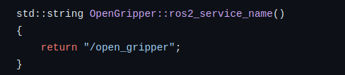
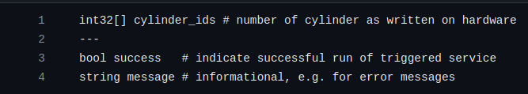
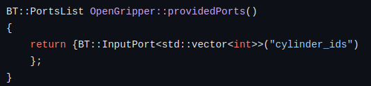
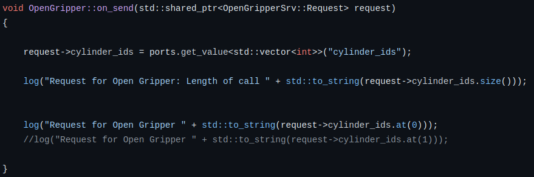
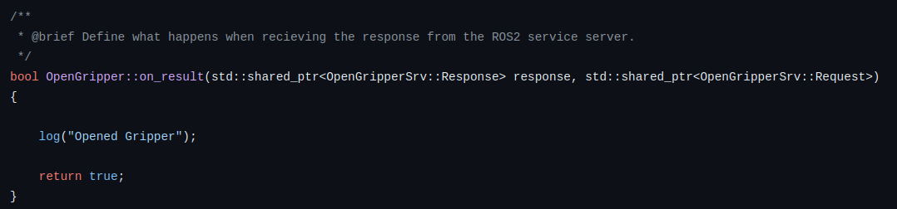

## Responsibility of OpenGripper.cpp / CloseGripper.cpp

    Location:
    aip_coordinator/aip_coordinator/src/services/OpenGripper.cpp

    Close-Gripper:
    aip_coordinator/aip_coordinator/src/services/CloseGripper.cpp


1. Definition of the service name: /open_gripper. This will be the name of the element in Groot and of the service; callable on the terminal.
   
    


2. Define the needed ports. Defined in the OpenGripper.srv (iras_interfaces/srv/)
   
    MoveGripper.srv:
    

    OpenGripper.cpp: 
    


3. Defines send data to AIP_BringUp. If MoveGripper.srv is extended, also extend it here.

    

4. Defines Success Messages, Message is freely changeable.
   
    


## Responsibility of Node.cpp

In this file (aip_coordinator/aip_coordinator/src/node.cpp) the BehaviorTreeFactory factory will initialize all the nodes of the behavior tree.


```c++
    // Gripper
    factory.registerNodeType<OpenGripper>("OpenGripper");
    factory.registerNodeType<CloseGripper>("CloseGripper");
```
If you add any Nodes/Services, which you want to be able to use in Groot, please add them here.

