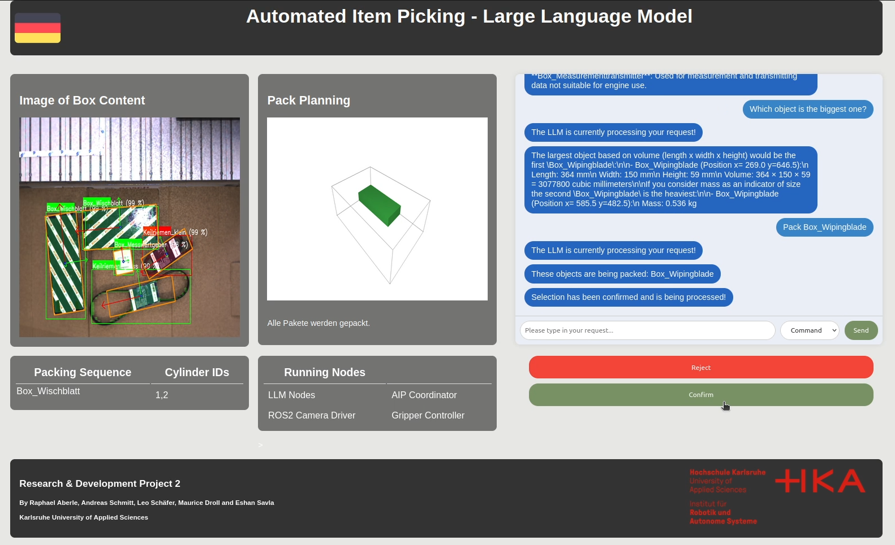

# Large Language Model

This section contains information on the language model of the "Automated Item Picking" system. The general structure of the model is described, as well as the integration with Docker and ROS2, followed by an overview of how to operate the LLM with various commands.

## Description of LLM

A Large Language Model (LLM) is built using a neural network architecture, typically based on transformers, which are designed for handling sequential data. It consists of layers of attention mechanisms that allow the model to focus on different parts of the input text simultaneously. The model is trained on massive amounts of text data, learning patterns in language, grammar, and context. It uses token embeddings to represent words or subwords as vectors, enabling the model to understand relationships between them. During inference, the model generates text by predicting the next token in a sequence based on the context provided by the previous tokens.

In our use case, the user is able to chat with the LLM and interact with it in three different ways (Chat, SceneChat and Command). Those communication methods are explained below.

This allows the user to get information about the detected items and context based item picking e.g. "Pack all the items needed to fix my windshield vipers".

The website can be used in german as well as in english.

## LLM with ROS2

The LLM container is running as a ROS2 Node and contains a Ollama installation with Mistral Nemo as LLM. The container also hosts the website where the user interaction takes place.

## Description of Website

As soon as the container has been started, the website can be accessed. It is hosted locally and is available via the following URL:

```shell
http://localhost:8080/
```

### Overview of Website

The website contains several elements that also provide an overview of the current status of the machine.

On the left-hand side is an image of the current depth camera readings. In the middle of the page is the result of the packing algorithm. It shows the calculated container as it will be packed by the robot. On the right-hand side is the LLM's interaction panel. This is where the chat is displayed and where commands can be entered.
The packing sequence of the package and the cylinder IDs are displayed below the left image. The currently running nodes are displayed below the image of the calculated container. This panel is primarily used to analyse the whole system.

# Image of the Website / User Frontend




### Used Technologies

- Ollama to run the LLMs 
- Ollama API to connect to the LLMs with Python (https://github.com/ollama/ollama-python)
- Python. Flask for Frontend (as well as CSS, HTML, JavaScript)
- ROS2 to make it work with the project setting and robot

### Structure of the Docker container

In total there are 4 packages created on its own in this docker container, the rest are imported from the other docker containers:

UserFrontend/ Website : *pkg_website_llm*

LLM-Call/Pre-/PostProcessing: *pkg_llm_docker*

ROS2 Interfaces to the other dockers: *llm_interfaces*

ROS2 Action Interface used interally: *llm_action_interfaces*

### Interaction and possible Commands

The chat with the LLM offers various options for interaction. Different chat modes are available via a drop-down selection in the bottom right-hand area of the chat window.

#### Regular Chat

This mode is selected by choosing "**Chat**". Normal chat is possible here. The LLM has no scene understanding of the camera or associated object information. For example, a question can be asked about how to repair a car.

#### Chat including additional Object Information

This mode can be selected with "**SceneChat**". In this mode, the LLM has an understanding of the scene and background information on the respective objects from the material master. Specific information, such as the position in the scene or the weight of an object, can be queried. A typical input could be: Tell me everything you know about the object in the centre of the scene.

#### Command

This mode is selected with "**Befehl**"/ "**Command**". It should be used when objects are to be transferred to the packing algorithm. In this mode a JSON object is created in the background with the objects to be packed. The objects are specified in the chat. If the selection is to be packed, this must be confirmed with the 'Bestätigen' button. The objects are then passed to the packing algorithm. The displayed selection can alternatively be rejected with the "Ablehnen" button. A typical command might be Pack part X and part Y.

## How to run the LLM container

To run the following commands, the Docker container must already be running. To start the Docker container, clone the LLM repository and navigate to the LLM_Scene_Docker folder. Launch the docker using the following terminal command:

```shell
source start_docker.sh
```

Once the container is running open a new terminal and connect to the running container with the following command.

```shell
docker exec -it llm_docker bash
```
Once the container is started, the entry point is directly on the cli of ollama.

Then run one of the following commands.

### Start Website and LLM via Launchfile *(preferred option)*

```shell
cd && cd ros_ws && colcon build && source install/setup.bash && cd src/pkg_website_llm && cd launch && clear && ros2 launch launch_all_services.py
```

### Start everything without the LLM

```shell
cd && cd ros_ws && colcon build && source install/setup.bash && cd src/pkg_website_llm && cd launch && clear && ros2 launch launch_UserInterface_without_llm.py
```

### Start only LLM

```shell
cd && cd ros_ws && colcon build && source install/setup.bash && cd src/pkg_website_llm && cd launch && clear && ros2 launch launch_only_LLM.py
```


## How to request the User Input

1. Connect to Docker
2. Run the following commands

```bash
ros2 service call /LLM/user_interaction llm_interfaces/srv/UserInteraction {''}
```


Subsequently the terminal shows the user input.

## How to send a test request to the LLM

With the following command it is possible to start the action server of the LLM.

```bash
ros2 action send_goal /LLM/llm_action_server llm_action_interfaces/action/LLM "{userinput: 'Box_Wischblatt'}"
```

## *For Debugging:* How to start the Action Client and Server to send the user input to the LLM

### Client

1. Open New Terminal
2. Connect to LLM_Docker
3. Run the command

    ```shell
    colcon build && source install/setup.bash
    ```

4. Navigate to the folder using:

    ```shell
    cd src/pkg_website_llm/pkg_website_llm/
    ```

5. Run the command

    ```shell
    python3 ActionClientToPreProcessing.py
    ```

### Server

1. Open New Terminal
2. Connect to LLM_Docker
3. Run the command

    ```shell
    colcon build && source install/setup.bash
    ```

4. Navigate to the folder using:

    ```shell
    cd /src/pkg_llm_docker/pkg_llm_docker
    ```

5. python3 LLM_Action_Server.py

With the following command you can send a test request to the LLM

```shell
ros2 action send_goal /llm_action_server llm_action_interfaces/action/LLM "{userinput: 'BEFEHL: Box_Wischblatt' }"
```
## How to change the used LLM

1. Search for compatible model on https://ollama.com/library 
2. Change it in StartOllama.sh -> line 9
3. Change it in pkg_llm_docker OllamaInteraction.py 
   Chat and Generate-Function!
```python 
    # Chat functionality with Ollama API
    def getObjectFromScene(role, prompt):
        return ollama.chat(model='mistral-nemo', messages=[
                {
                    'role': role,
                    'content': prompt,
                    'options': {"seed": 123},
                    "context": [],
                },
        ])
```