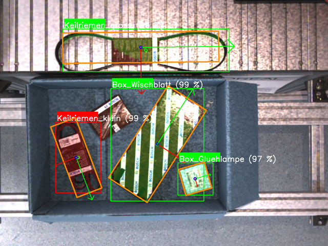

# Object Detection
This section details the structure and functionalities of the object detection node. For object detection, the inference functionalities of Tensorflow were utilized. The "Object Detector Tensorflow" repository provides object detection via Tensorflow through a ROS interface. Essentially, there are two ways to request an inference, available as two ROS nodes. The "Continuous Detection Node" facilitates detections in a ROS node using a publisher and subscriber. This enables continuous detection by receiving current images via the subscriber and sending the detected object instances as detections. The second option, the "Detection Node," allows detections to be requested through a server-client architecture. For the entire AIP application, only the Detection Node is used.

### Node Architecture

The Detection Node provides the functionality to perform an inference on the current image of the scene upon a client's request. This node receives color and depth images of the scene through two topics. A client sends a request to the server of the Detection Node in the form of a service call. The "DetectObjects" service comprises of a request message that defines a region of interest within the image, where the inference should be performed. The response message contains the result image with all instances of detected objects and their masks, the reference depth image corresponding to the detections and a custom detections message containing all the detected object details. This message comprises of a list of attributes for each detected object. The attributes being – object class, a unique instance id, the class name, likelihood of the object class, the bounding box of the object in the image along with its center, the mask of the object and lastly the orientation of the object. 

### Operating Principle
The detection process within the detection node can be broken down into three operating steps:
1. Asnychronus data reception
    - The detection node receives the color and depth images asynchronously. When a client triggers a request, the node waits until the most recent images have been collected and then triggers an inference.
2. Inference
    - The inference is performed on the color image recieved. A pretrained model along with the appropriate class labels is used to carry out an instance segmentation of products in the scene. The inference is performed on the region of interest defined by the client. Attributes are processed and collected as defined in the Detection message.
3. Response
    - Upon completion of the inference process, the detections are cleaned up. This involved discarding detections with a likelihood below a certain threshold and filtering out detections that are not relevant. These cleaned detections are packaged in the response to the client along with the result image with annotated detections and the corresponding depth image to be utilised for further processing (reference image). Simultaneously the detections and result image are published regularly on their respective topics.

Result image:


### How to start
1. Place the tensorflow saved_model folder into the `./ros/object_detector_tensorflow/data/` path
2. Write the correct names of possible classes in the file `./ros/object_detector_tensorflow/data/label_map.txt`
   ```yaml
   class1 #label id = 0
   class2 #label id = 1
   ```
3. Set the correct ROS_DOMAIN_ID in `./.env`
    ```yaml
    ROS_DOMAIN_ID=66
    ```
4. (only once) Build the docker container
   ```bash
   . build_docker.sh
   ```
5. Start the docker container
   ```bash
   . start_docker.sh
   ```
6. Launch the ros node
   ```bash
   ros2 launch object_detector_tensorflow detection.launch.py
   ```

For further instructions on testing the detection node as well as configuring parameters such as topics and publish frequencies, refer to the [object detector tensorflow repository](https://github.com/eshan-savla/object_detector_tensorflow)