## How to configure the PLC?

This sections provides a guide to configure the PLC for the AIP application.

For more information, please also review the corresponding folder in the AIP MS Teams Team: [**_IRAS Students/General/01-IRAS_Wiki/2-Projects/2.1-Automated_Item_Picking/20_Beckhoff_PLC/_**](https://hskarlsruhede.sharepoint.com/:f:/s/Robolab/EsXb2rS7tkNHiE9Vva1hRJQBlkx3YtZ9MsPilZJKrE4KLA?e=RStLJ4)

Especially, pay attention to the official manufacturer descriptions stored in  [**_IRAS Students/General/01-IRAS_Wiki/2-Projects/2.1-Automated_Item_Picking/20_Beckhoff_PLC/Manufacturer documentation_**](https://hskarlsruhede.sharepoint.com/:f:/s/Robolab/EtWBKyUWYTJJhI81cag6Vu4BRYX0zx6OWt2i09hfl6ZEaQ?e=ReFuOb)

## I. General Setup

1. **Load the necessary device description files of the used components per manufacturer**

    Note: _Please pay attention to use the correct file storage location enabling the TwinCAT Shell to read them in correctly_
  
          C:\TwinCAT\3.1\Config\Io\EtherCAT

    The interface to the KUKA KR10 KR C4 robot requires the EL6695-1001

          File: KUKA_EL6695sec.xml

2. **Establish network connection from your PC to the PLC**
   - Connect your pc with a LAN cable directly to the PLC
   - Search for the hidden TwinCAT XAE symbol within your tab bar
   - Right click the TwinCAT XAE symbol
   - Click "_Router/Routes editieren_"

      

   - Broadcast Search for your PLC

      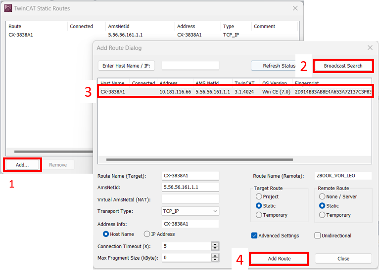

   - Choose the PLC by selecting it
   - Add Route to the PLC
     - For the current valid IP address can be found in the specific markdown file of this repository. It shall be:

            IP:        10.181.116.66
            Username:  Administrator
            Password:  1

3. **Start the PLC in configuration mode**

4. **Option 1: Use the existing project**
      - Download the running AIP TwinCAT application project from the [folder](https://hskarlsruhede.sharepoint.com/:f:/s/Robolab/EvBXPR8iiC1CjPC9OmHc55QB9pIL2lSHhNAUp725h_jsCA?e=HsHzn0) in the AIP MS Teams Team
      - Make your desired adjustments to your local copy of the standard AIP TwinCAT Application project

**Note: _The following steps are only necessary if no project exists yet or if you want to make changes._**

5. **Option 2: Create new project package**
    - Create new TwinCAT project package ("TwinCAT Project") <br>
      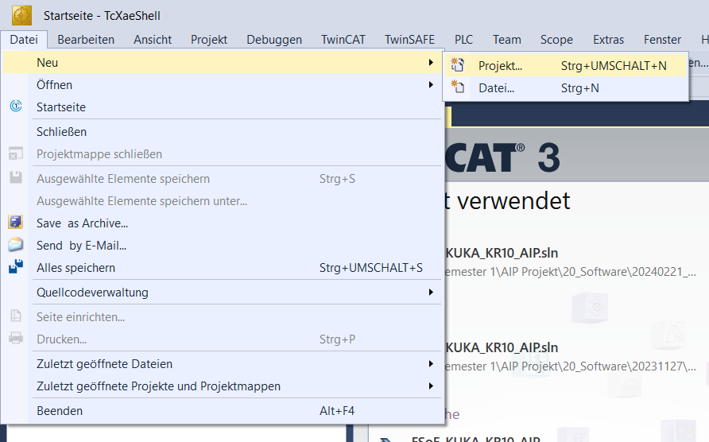
 
    - Load the IOs by using the integrate scan function
        - Verify that the automatic scan has detected all physical available IOsw
          - Status "_OP_" is necessary

      ## => Add picture for the automatic scan when directly connected to the PLC

    - Check the input/output signals currently present  
        - Select terminal, select module, select corresponding channel  
        - Necessary tab: _Online_ <br>
      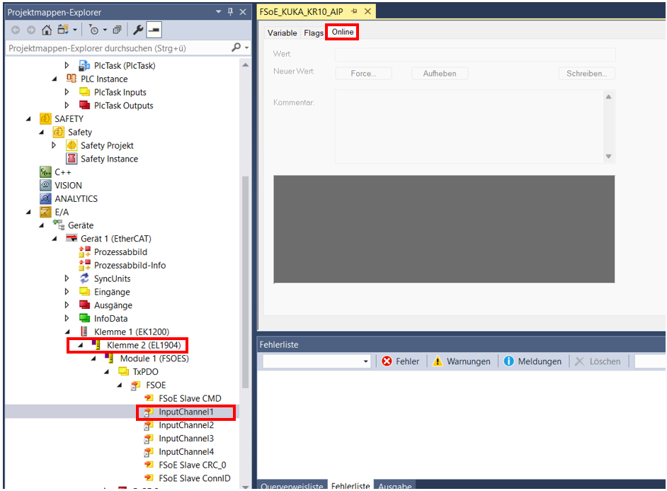


6. **Create a new safety project**
  
    Note: _This section is only related to the yellow PLC safety terminals. It has to be connected at least one safety terminal._
    - Create new safety project part<br>
      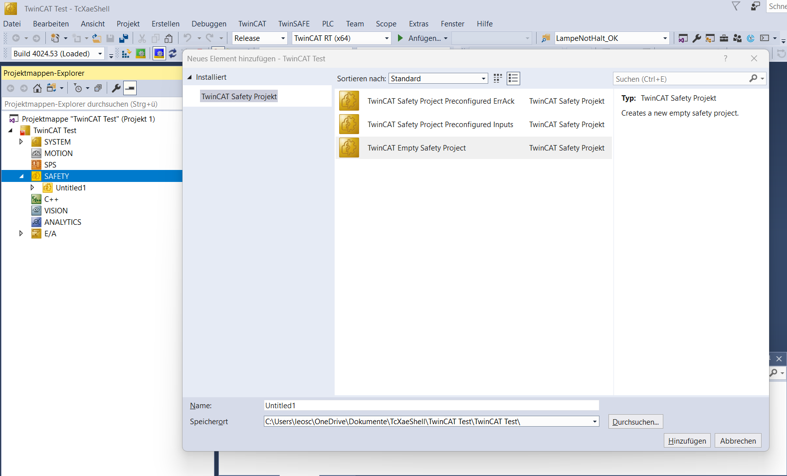

    - Create TwinSafeGroup <br>
      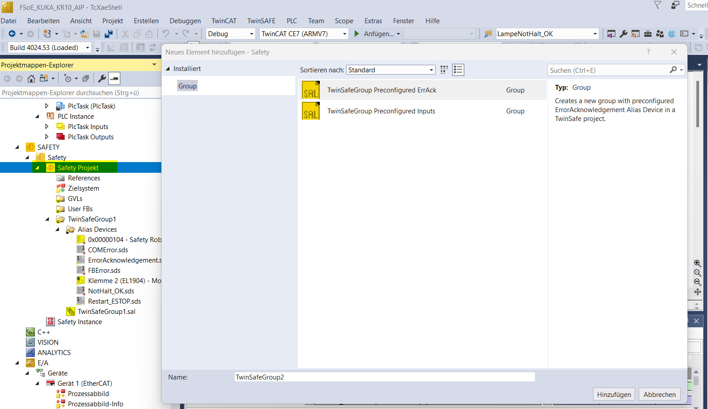

     - Parameterisation of the individual modules
        - Import the necessary alias devices from the current IO configuration <br>
      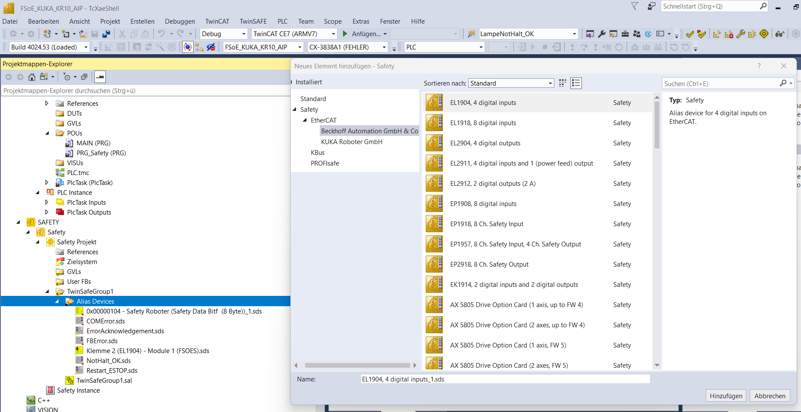

        - FSOE address must match the one of the KUKA control (default: 8504)<br>
        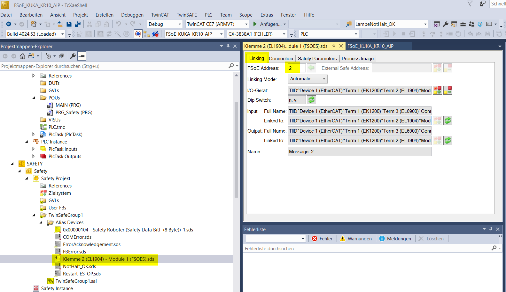
        - Check the process images <br>
        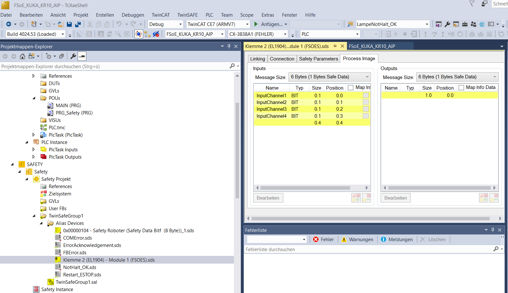
        - Choose the device
          - Tab: Safety Parameters
          - e.g. EL1904:
            - Using the Sick LiDAR Scanner MicroScan3 Core I/O with OSSD requires the following setting for channel 3 + 4:
              - Deactivate sensor test due to the self-examined test of the scanner
              - Set "_Asynchronous analysis OSSD, sensor test deactived_"
              - For more information, please check the operating manual from the Sick website or the AIP MS Teams Team documentation <br>
              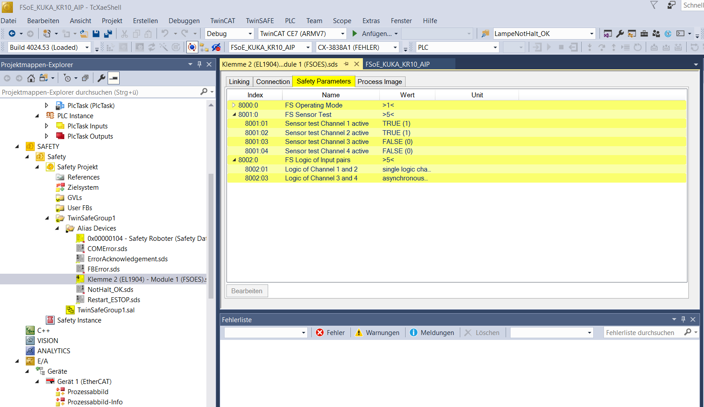    
          - The similiar must be done for the KUKA robot part. (see given TwinCAT project)
        - Check the target system
          - This has to equal your master terminal (here: EL6900)
          - Verify if the physical set DIP switch setting matches the one in TwinCAT
              

        - Create a SafeEstop building block by drag and drop from the toolbox <br>
          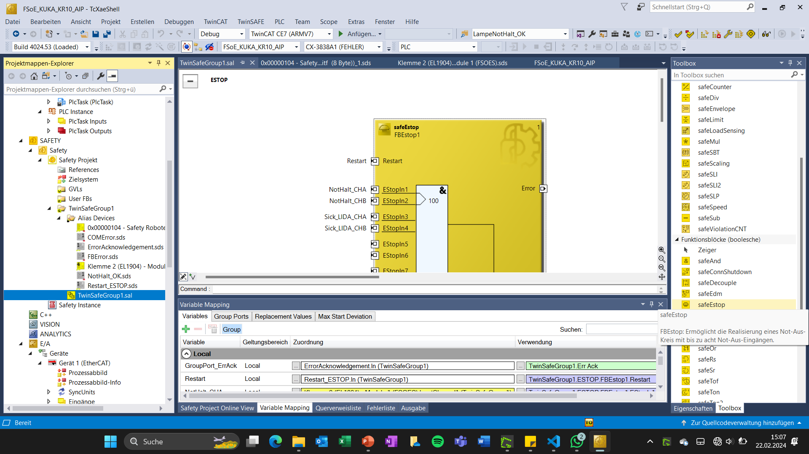    
          - Name the explicit inputs and outputs with your variable name

          - Map the variables to the corresponding channels of the modules or further variables used
          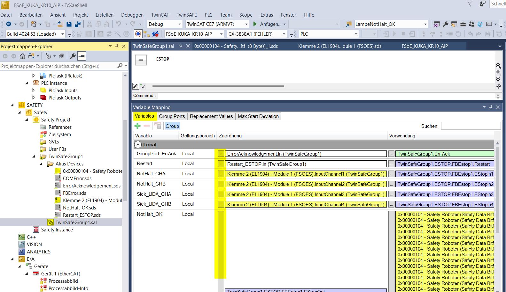    

            - **Input side:**
  
                  - NotHalt CHA to EL1901 Channel 1 
                  - NotHalt CHB to EL1901 Channel 2
                  - Sick_LIDAR_CHA to EL1901 Channel 3
                  - Sick_LIDAR_CHB to EL1901 Channel 4

              Note: _It requires a logical connection of the safety stops as channel A and B need to react at the same time when the button is pressed. Even if one component is damaged, the safety is not allowed to be endangered. Consequently the control must trigger an error if a signal is not detected directly (low demand system)._
  
            - **Output side:**
  
                    EStopOut = NotHalt_OK = SafetyRoboter

                Note: _To communicate with the KUKA KR10 robot, the process image must from Beckhoff PLC and KUKA KR C4 control must match. If you wan´t to e.g. set status lamps, it is necessary to report to a variable im regular PLC part._

            - Set the input of the regular PLC part. 
                - It is necessary to restart the function module after starting up the system
                - Add an alias device (input from the regular PLC part) <br>
                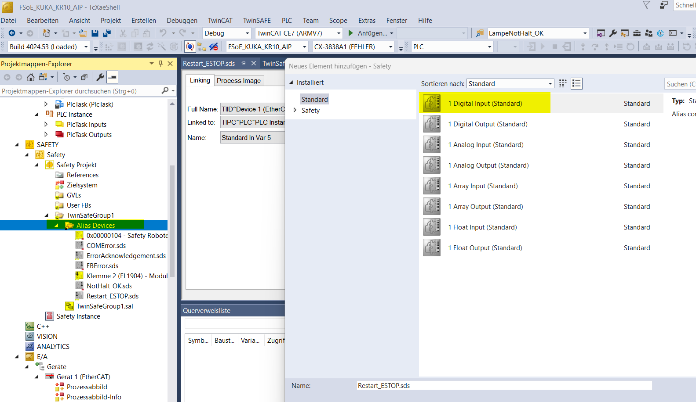    
                - Execute a variables mapping in the TwinSAFE group 
                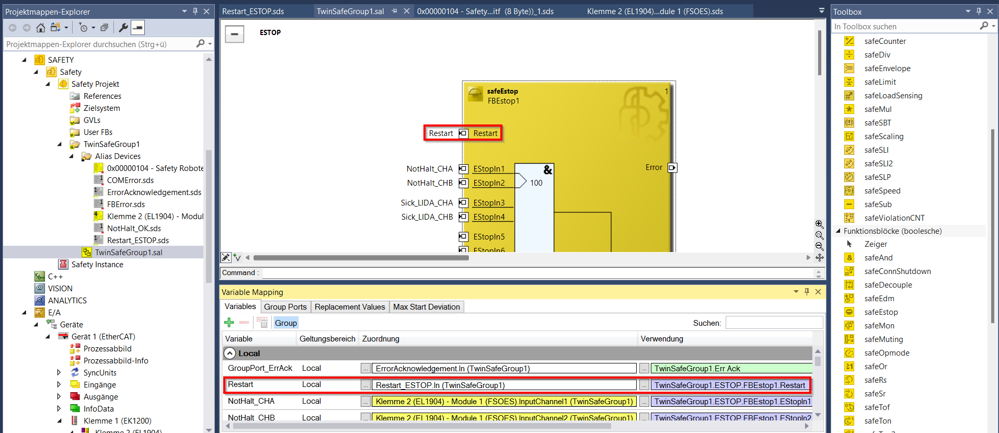
                - Link them with the PLC variables too
                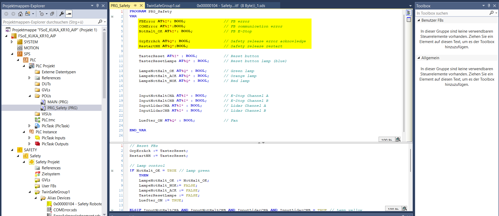

            - Set the outputs to the PLC
                - e.g. communication error ("COMError"), function module fault ("FBError"), NotHalt_OK to further use e.g. status message
                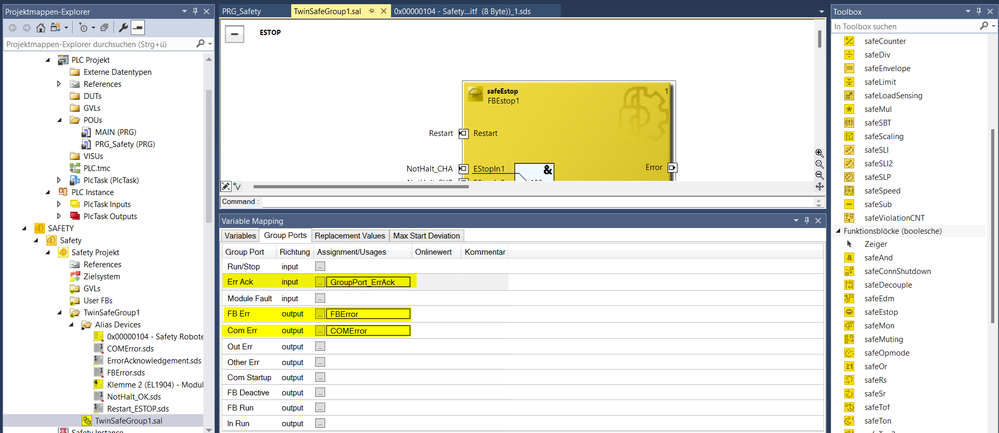
                - Link them with the PLC variables too (see above)

     - Load the configuration on the physical safety modules
        - Position your curser onto the desired TwinSafeGroup e.g. TwinSafeGroup1
        - Click _"TwinSAFE/Mehrere Safety Projekte herunterladen"_
        - Choose the desired modules
        - Confirm
  
                Username:  Administrator
                Password:  TwinSAFE
        - Save the complete project

# => TODO: Add pictures while connected- to the physical PLC hardware 


7. **Create new standard PLC project**

      Note: _It is a separated project which is able to receive inputs from the safety part_
    - Use a right click on the "PLC" / "SPS" icon and select "Add new item" 
      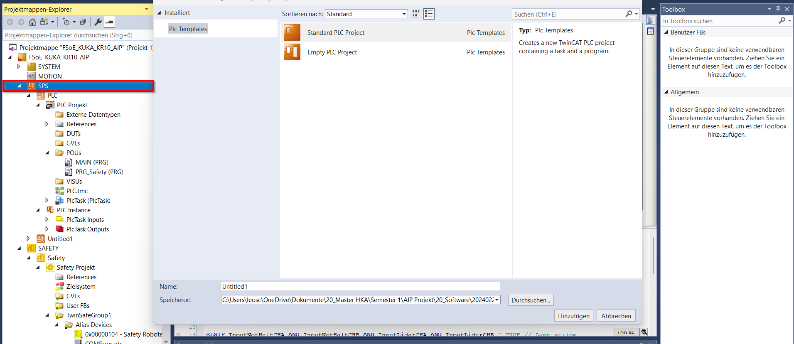

   - Create Programmble object units (POUs)
     - The _main_ has to call the PRG_Safety POU in order to run it on the PLC
    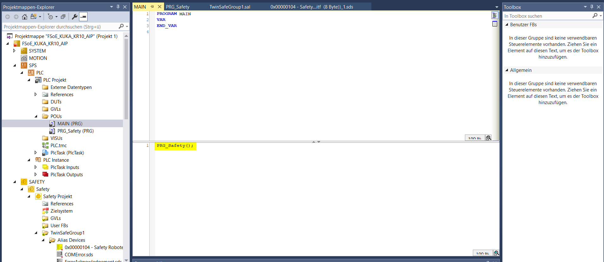
       - It generates a PLC task im main (see PLC tasks, PLC).
       - Cyclus ticks of the PLC can be reviewed via System/Tasks/PLCTasks
     - PRG_Safety
       - Read Inputs-/ Ouputs of the safety PLC
         - Note: Outputs of safety PLC are inputs of the standard PLC
  
                - FBError     AT%I*:  BOOL; 
                - COMError    AT%I*:  BOOL; 
                - NotHalt_OK  AT%I*:  BOOL;

       - How to enable the acknowledgment via the external control panel?
          - Create a variable for the acknowledgement of the function group error "_GrpErrAck_" as output to the safety PLC
          - Create a variable for the restart after the start up "_RestartNH_" as output to the safety PLC
          - Create the variable "_TasterReset_" as input on the standard PLC and link it with the hardware module
          - Create logical link in the executable programm code

                - GrpErrAck := TasterReset; 
                - RestartNH := TasterReset; 

       - Set status lamp for operating status display <br>
          ```bash
            // Reset FBs
            GrpErrAck := TasterReset;
            RestartNH := TasterReset;

            // Lamp control
            IF NotHalt_OK = TRUE // Lamp green
              THEN	
              LampeNotHalt_OK := NotHalt_OK;
              LampeNotHalt_NOK:= FALSE;
              LampeNotHalt_ACK := FALSE;
              TasterResetLampe := FALSE;
              Luefter_ON := TRUE; 
              
            ELSIF InputNotHaltCHA AND InputNotHaltCHB AND InputLidarCHA AND InputLidarCHB = TRUE // Lamp yellow
              THEN 
              LampeNotHalt_ACK := TRUE;
              TasterResetLampe := TRUE; 
              LampeNotHalt_NOK:= FALSE;
              LampeNotHalt_OK := FALSE;
              Luefter_ON := TRUE; 
              
            ELSIF NotHalt_OK = FALSE // Lamp red
              THEN	
              LampeNotHalt_NOK:= NOT NotHalt_OK;
              LampeNotHalt_OK := FALSE;
              LampeNotHalt_ACK := FALSE;
              TasterResetLampe := FALSE;
              Luefter_ON := FALSE; 
              
            END_IF
            ```

         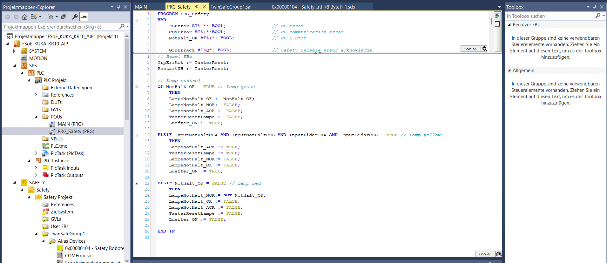  <br> 
        - Use the input from the safety PLC signal for _"NotHalt_OK"_ as output from the function module
        - Create project map to instanciate the variables
            - Use the tab: "_Erstellen_" // "_Create_" => "_Projektmappe erstellen_" //  "_Create project map_"
          - Set the output to the lamps 
              - Review the defined variables name in the upper section of the PRG_Safety POU
              ```bash
                LampeNotHalt_OK AT%Q* : BOOL;     	// Green lamp
	            LampeNotHalt_ACK AT%Q* : BOOL; 		// Orange lamp
	            LampeNotHalt_NOK AT%Q* : BOOL;		// Red lamp
              ```
              - Connect them to the physical hardware in the IO topology (e.g. "_LampeNotHalt_OK_")
               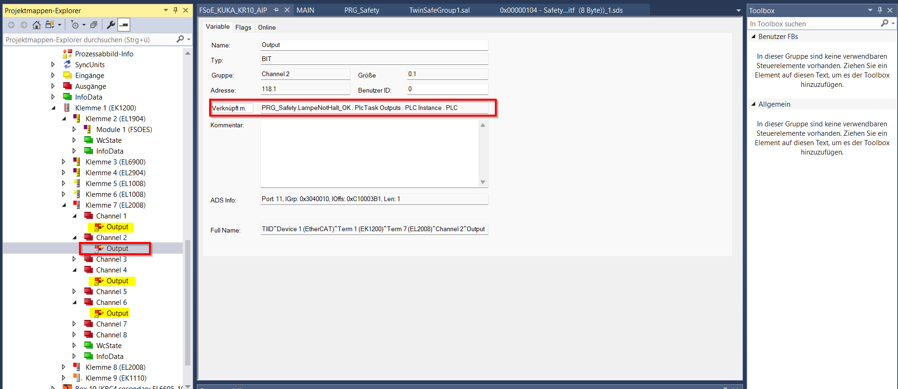  <br> 

          - Create logical link in the executable programme code
  
                LampeNotHalt_OK := NotHalt_OK; (see screenshot above)

8. **Adjust the process image of the KUKA KR C4 module in the IO structure**
   - Select the box of the KR C4 in the tab "_Slots_"
     - Choose the corresponding process image ("Safety Daten"/ "Reguläre Daten"/ "Kombiniert")
    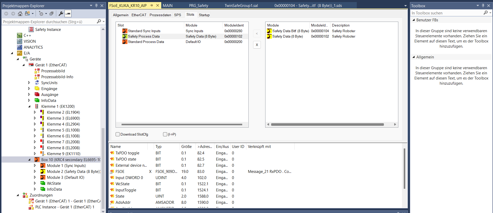  <br> 
   - Module 2 (Safety Data (8 Byte)); TxPDO - FSOE (Inputs) and RxPDO - FSOE must match the process image to the Beckhoff PLC
      - Verify the process image with the alias device one in the safety PLC
      - Select the inputs / outputs of the module EL6900

9. **Transfer configuration to the PLC**
    - By pressing "Konfiguration aktivieren" // "Activate configuration" on the top left corner of the TwinCAT UI 
    - Note: _To load the configuration, please verify that your PLC is in configuration mode._

## II. Setting up signal lamps, external control panel and ventilation

This section deals with the set up of the signal lamps for the application status lamps, external control panel and includes the ventilation system.

For details on cabling, please refer to the [circuit diagram](https://hskarlsruhede.sharepoint.com/:b:/s/Robolab/EQobmkHrY0RFslK2JM3dPUMB7YcZyiPEdmcFV-oI7fIJPQ?e=fbCcIk) in the AIP MS Teams Team.

1. Extending the "PRG_Safety (PRG)" programmable object unit (POU) in the standard plc part
   - Declaring the new variables for inputs from the safety related components

      ```bash
      InputNotHaltCHA AT%I* : BOOL;  
      InputNotHaltCHB AT%I* : BOOL;  
      InputLidarCHA AT%I* : BOOL;  
      InputLidarCHB AT%I* : BOOL;  
      ```

   - Declaring the new variables for outputs to the lamps

      ```bash
      TasterResetLampe AT%Q* : BOOL;
      LampeNotHalt_OK AT%Q* : BOOL;     
      LampeNotHalt_NOK AT%Q* : BOOL;
      LampeNotHalt_ACK AT%Q* : BOOL;
      ```

    For reference please review the following image:

    

2. Connect the PLC variables with the physical inputs / outputs
    - Take the correct channels of the terminals from the valid [circuit diagram](https://hskarlsruhede.sharepoint.com/:b:/s/Robolab/EQobmkHrY0RFslK2JM3dPUMB7YcZyiPEdmcFV-oI7fIJPQ?e=fbCcIk)
    - Search for the correct input/ output terminals in the IO structure
      - Inputs:  e.g. InputNotHaltCHA
        - Besides the other input signals from the safety related components, the signal from channel A of the safety stop ("NotHalt") will queried in a if condition to set the status lamps.
        - To generate a hardware feedback, the PLC variable has to be mapped to the corresponding output.
          - In this case, the InputNotHaltCHA has to be mapped to terminal EL1904 InputChannel1
          - Search for the corresponding terminal and channel in the IO topology

          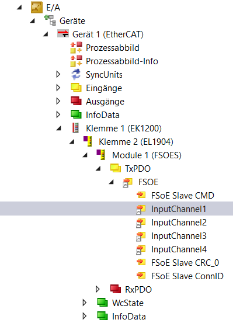

          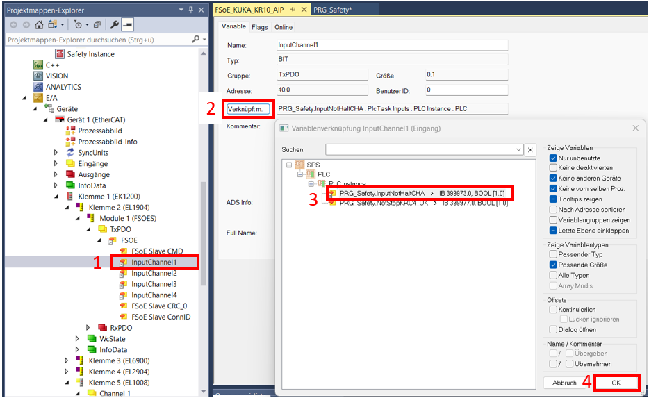

      - Outputs: e.g. TasterResetLamp
        - The blue lamp shall light up if it is necessary to acknowledge after a safety stop was triggered. It is necessary to provide active human feedback so that the application can resume operation.

## III. Miscellaneous

- Remote access to the device manager can be enabled by using the CERHOST programm.
- It is located in the following [folder](https://hskarlsruhede.sharepoint.com/:u:/s/Robolab/Edmn-Y5lowRPluMAa_jBZO4BiidjAPeTsX1Hcp4GsXG-qQ?e=9T6Gwt) of the AIP MS Teams Team
- For trouble shooting if license error occurs, see [Troubleshooting](../docs/troubleshooting.md)
- Monitor the online status of the PLC module
  - Select the TwinSafeGroup
  - Click _"TwinSAFE/Online Daten anzeigen"_
- Restart from the PLC
  - Select SPS
  - Click _"POU/PRG_Safety/Einloggen"_ (via the green symbol)
  - Set the values for the variables as prepared value
  - Transfer the prepared values via write


# TODO

- [X] Add standard PLC description 
- [X] Add safety PLC description 
- [X] Add pictures for standard & safety plc 
- [ ] Add pictures which require to be connected to the PLC
- [ ] Add description and pictures to enable application status lamps for signals from the KR C4 to the PLC 

