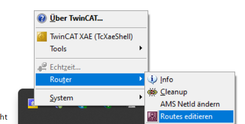

# How to configure the PLC? 

This sections provides a quick guide to configure the PLC for the AIP application. 

For more information, please also review the corresponding folder in the AIP MS Teams Team: [**_IRAS Students/General/01-IRAS_Wiki/2-Projects/2.1-Automated_Item_Picking/20_Beckhoff_PLC/_**](https://hskarlsruhede.sharepoint.com/:f:/s/Robolab/EsXb2rS7tkNHiE9Vva1hRJQBlkx3YtZ9MsPilZJKrE4KLA?e=RStLJ4)

Especially, pay attention to the official manufacturer descriptions stored in  [**_IRAS Students/General/01-IRAS_Wiki/2-Projects/2.1-Automated_Item_Picking/20_Beckhoff_PLC/Manufacturer documentation_**](https://hskarlsruhede.sharepoint.com/:f:/s/Robolab/EtWBKyUWYTJJhI81cag6Vu4BRYX0zx6OWt2i09hfl6ZEaQ?e=ReFuOb)

1. Load the necessary device description files of used components per manufacturer  
    - **Note:** Please pay attention to use the correct file storage location enabling the TwinCAT Shell to read them in correctly  
        
          C:\TwinCAT\3.1\Config\Io\EtherCAT
    
    - The interface to the KUKA KR10 KR C4 robot requires the EL6695-1001

          File: KUKA_EL6695sec.xml

2. Establish network connection from your pc to the plc
   - Connect your pc with a LAN cable directly to the plc
   - Search for the hidden TwinCAT XAE symbol within your tab bar
   - Right click the TwinCAT XAE symbol
   - Click <Router/Routes editieren>  
     
   - Broadcast Search for your plc 
   - Choose the plc by selecting it 
   - Add Route to the plc 
     - For the current valid IP address can be found in the specific Markdown file of this repository. It shall be:  
            
            IP:        10.181.116.66
            Username:  Administrator
            Password:  1

3. Start the plc in configuration mode 
4. **Use the existing project**
      - Grab the running AIP TwinCAT application project from the [folder](https://hskarlsruhede.sharepoint.com/:f:/s/Robolab/EvBXPR8iiC1CjPC9OmHc55QB9pIL2lSHhNAUp725h_jsCA?e=HsHzn0) in the AIP MS Teams Team
      - Make your desired adjustments to your local copy of the standard AIP TwinCAT Application project 
  
5. **Create new project**
    - Load the IOs by using the integrate scan function 
        - Verify that the automatic scan has detected all physical available IOs
        - Check the current status of all topology elements 
          - use "Gerät 1 (EtherCat)
           -  Tab can be read online 
           - Status "OP" is necessary 
    - Check the input/output signals currently present  
        - Select terminal, select module, select corresponding channel  
        - Necessary tab: Online
6. **Create a new safety project**
    - Note: _This section is only related to the yellow plc safety terminals. It has to be connected at least one safety terminal._
    - Parameterisation of the individual modules
        - Import the necessary alias devices from the current IO ocnfiguration 
        - FSOE address must match the one of the KUKA control (default: 8504)
        - Check the process images
        - Choose the device
          - Tab: Safety Parameters
          - e.g. EL1904: 
            - Using the Sick LiDAR Scanner MicroScan3 Core I/O with OSSD requires the following setting for channel 3 + 4: 
              - Deactivate sensor test due to the self-examined test of the scanner 
              - Set "asynchronous analysis OSSD, sensor test deactived"
              - For more information, please check the operating manual from the Sick website or the AIP MS Teams Team documentation
        - Check the target system 
          - This has to equal your master terminal (here: EL6900)
          - Verify if the physical set DIP switch setting matches the one in TwinCAT 
        - Create a TwinSafeGroup 
          - Create a SafeEstop building block 
          - Map the variables to the corresponding channels of the modules or further variables used
            - **Input side:**  
  
                  - NotHalt CHA to In1 
                  - NotHalt CHB to In2
  
                - Note: It requires a logical connection of the safety stops as channel A and B need to react at the same time when the button is pressed. Even if one component is damaged, the safety is not allowed to be jeopardised. Consequently the control must trigger an error if a signal is not detected directly. (low demand system)               
  
            - **Output side:**  
  
                    EStopOut = NotHalt_OK
                
                - Note: To communicate with the KUKA KR10 robot, the process image must from Beckhoff PLC and KUKA KR C4 control must match. If you wan´t to e.g. set status lamps, it is necessary to report to a variable im regular plc part. 
            
            - Set the input of the regular plc part 
                - Necessary to restart the function module after starting up the system 
                - Add an alias device (input from the regular plc part)
                - Execute a variables mapping in the TwinSAFE group 
                - Link them with the plc variables too 
            - Set the outputs to the plc 
                - e.g. communication error ("COMError"), function module fault ("FBError"), NotHalt_OK to further use e.g. status message
                - Link them with the plc variables too 
      - **Load the configuration on the physical safety modules**
        - Position your curser onto the desired TwinSafeGroup e.g. TwinSafeGroup1
        - Click _"TwinSAFE/Mehrere Safety Projekte herunterladen"_
        - Choose the desired modules
        - Confirm 
  
                Username:  Administrator
                Password:  TwinSAFE
       
       - Save the complete project
7. **Create new standard plc project**
   - Note: _It is a separated proejct which is able to receive inputs from the safety part_
   - Create Programmble object units (POUs)
     - The _main_ has to run for the PRG_Safety POU
       - It must generate a plc task im main (see plc tasks, plc). 
       - Cyclus ticks of the plc can be reviewed via System/Tasks/PLCTasks
     - PRG_Safety
       - Read Inputs-/ Ouputs of the safety plc 
         - Note: Outputs of safety plc are inputs of the standard plc 
  
                - FBError     AT%I*:  BOOL; 
                - COMError    AT%I*:  BOOL; 
                - NotHalt_OK  AT%I*:  BOOL; 
        - How to enable the acknowledgment via the external control panel?
          - Create a variable for the acknowledgement of the function group error ("GrpErrAck") as output to the safety plc
          - Create a variable for the restart after the start up ("RestartNH") as output to the safety plc
          - Create the variable "TasterReset" as input on the standard plc and link it with the hardware module
          - Create logical link in the executable programm code 
            
                - GrpErrAck := TasterReset; 
                - RestartNH := TasterReset; 

        - Set status lamp for operating status display
          - Use the input from the safety plc signal for _"NotHalt_OK"_ as output from the function module 
          - Create project map to instanciate the variables 
            - Use the tab: "Erstellen" 
          - Set the output to the lamps ("LampeNotHalt_OK")
          - Create logical link in the executable programme code
  
                LampeNotHalt_OK := NotHalt_OK; 

8. **Adjust the process image of the KUKA KR C4 module in the IO structure**
   - Select the box of the KR C4 in the tab "Slots"
     - Choose the corresponding process image ("Safety Daten"/ "Reguläre Daten"/ "Kombiniert")
   - Module 2 (Safety Data (8 Byte)); TxPDO - FSOE (Inputs) and RxPDO - FSOE must match the process image to the Beckhoff plc
      - Verify the process image with the alias device one in the safety plc 
      - Select the inputs/ outputs of the module EL6900

9. **Transfer configuration to the PLC**

**Miscellaneous:**
- Remote access to the device manager can be enabled by using the CERHOST programm. 
- It is located in the following [folder](https://hskarlsruhede.sharepoint.com/:u:/s/Robolab/Edmn-Y5lowRPluMAa_jBZO4BiidjAPeTsX1Hcp4GsXG-qQ?e=9T6Gwt) of the AIP MS Teams Team
- License errors:   
`Free 7 days licenses are generated based on the current date and time of your pc`
  - If the battery of the plc is empty, the date will be resetted after every restart to the 01.01.2016. This triggers license errors preventing you to load the configuration to the physical modules.
  - Possible solutions: 
    - Long term: Replace the button battery of the PLC
    - short term: Set the correct date and time manually in the online device manager. This is required at every restart of the system. 
- Monitor the online status of the PLC module
  - Select the TwinSafeGroup
  - Click _"TwinSAFE/Online Daten anzeigen"_
- Restart from the PLC 
  - Select SPS
  - Click _"POU/PRG_Safety/Einloggen"_ (via the green symbol)
  - Set the values for the variables as prepared value 
  - Transfer the prepared values via write

