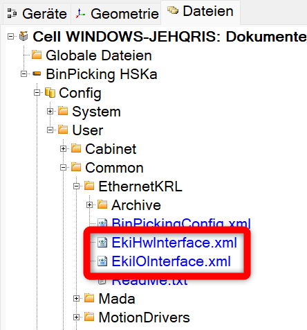
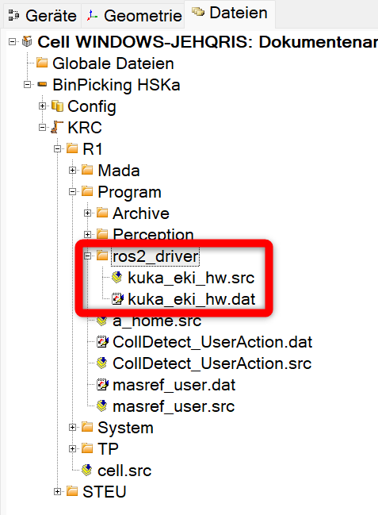

# How to configure WorkVisual

This sections provides a quick guide for the installation of WorkVisual as well as an overview of the project specific AIP WorkVisual project.

## I. How to install WorkVisual

1. Download WorkVisual from the official [KUKA website](https://kuka.sharefile.eu/share/view/seb15e6d0c9246e79/fofe824e-d661-457c-9858-97304df52369)
2. Install and run .exe
3. Connect to the same subnet as the KUKA robot. For more information to the IPs, please check this [Link](/docs/devices_ips_and_passwords.md).

    

## II. Overview of the AIP WorkVisual project

This sections provides an overview to the different components of the configured AIP WorkVisual project.
You will find the freezed project status in the corresponding MS Teams Team: 
[**_IRAS Students/General/01-IRAS_Wiki/2-Projects/2.1-Automated_Item_Picking/10_KUKA_WoV/20231130_AIP_KUKA_WoV_Project_**](https://hskarlsruhede.sharepoint.com/:f:/s/Robolab/Esc6STswNCFPnDBuxPwZ8QoBDzZO1w3VhKvccdllRSFXeQ?e=HVxMI5)

### Configuration of PLC communication

To set up the communication between robot control and the PLC, the EtherCAT communication interface needs to be implemented into the bus structure. The bus structure can be opened by double-clicking on the shown control (BinPicking HSKa (KRC4 compact - 8.5.5)). The necessary components are added to the KUKA Extension Bus (SYS-X44).

The module KRC4 primary EL6695-1001 can be added after importing the corresponding ESI device description. Check the documentation file "[KR_C4_EtherCAT_Bridge_FSoE_Master_Master_de](https://hskarlsruhede.sharepoint.com/:b:/s/Robolab/ERaAqqeBoAlDmdOa107Vn4sBQ-b2PggPapm9U5mhru5Jdw?e=lmfSFb)" on MS Teams to set up the configuration of the communication.

Additionally, the ifm IO-Link Master AL1332 is added to the bus structure. Here also the ESI device description must be imported previously.
For the configuration of the IO-Link master, in the tab "Modules" the following Bytes are assigned to the channels.


### Configuration of the peripheral field modules

To link the peripheral field modules with this robot control, the in- and outputs need to be mapped. Follow the instructions in the KUKA documentation "[AL1x3x_Kuka_Rev1_EN](https://hskarlsruhede.sharepoint.com/:p:/s/Robolab/EQevFUJAQKxMmUt3gQI4bckB9NjO45v9MAqVVceTXfnIew?e=DgMFya)" in the KUKA Startup Package on MS Teams.

Open the tab "E/A Mapping" and choose the marked settings shown below in the image. By doing this the in- and outputs of the field modules can be mapped to the KR C robot control.


Right-click on the in- or output you want to map in the left and right lower boxes. Not-mapped I/Os are marked grey. By clicking on the symbol on the bottom between the boxes the variables are mapped. Afterwards it appears in the upper box. The module number represents the port/channel number on the IO-Link master.

By clicking on the pen in the bottom right corner, the signal editor can be opened. Here the previously mapped in- and outputs are shown, broken down on bit level. The names of the variables can be adapted in this view.


The byteorder indicates how the single Bytes are stored in the controller memory. IO-Link uses a different byte order than the KUKA control. As soon as the amount of data is greater than 1 bit (e.g. byte), the signals must be swapped so that they are processed in the correct order. Swapped bytes are marked, like the red square in the picture above shows. You can swap bytes by dragging the dash, marked with the arrow. You need to swap at least one byte.

The number of bytes and bits used must also be adjusted. For example, reed contacts only use one bit, while the measured value of the pressure sensor is transferred with one byte. Additionally, the pressure sensor also uses individual bits. The number of bits can be adjusted by dragging the line on the right-hand side. The information on how the modules are integrated can be found in the data sheets.

Once the inputs and outputs have been integrated, they still need to be created in the KUKA Smartpad. To do this, the "Long text editor" must be selected in the "Editors" tab in WorkVisual. The variable name can be entered here in the previously assigned position. Once the programme has been uploaded to the controller, the created variables are visible and can be read or controlled.
Below you can find an example of the long text editor for the digital outputs below.


Below you can find a picture of all mapped inputs and outputs.


### Required Ethernet KRL Interface (EKI) files

EKI is used to exchange data between a KUKA robot controller and an external system. EthernetKRL is an optional software package that makes it possible to send and receive XML or binary data via the TCP/IP or UDP/IP protocol. This can be useful when connecting or controlling a robot with other devices or applications.

EKI offers the following options:

- You can set up and customise an Ethernet connection using an XML-based configuration file.
- You can send and receive data in various formats, such as freely configurable XML structures, binary data with fixed or variable length or direct strings.
- You can configure the robot controller and the external system as a client or server and operate up to 16 active connections simultaneously.
- You can signal events such as a successful connection, the receipt of a specific element or a complete data set by setting an output or a flag.
- You can use error handling and diagnostic functions to monitor and correct data transmission.

To use EthernetKRL, the software package must first be installed on the robot controller. You can read about this in chapter 4 of the [KUKA EKI documentation](https://hskarlsruhede.sharepoint.com/:b:/s/Robolab/ET_KrUUq_xJKnf7MTesLJNUBsFdrSCsVxshHmyi3J7YznA?e=GNgcrq) on MS Teams. The network connection must also be set up via the KLI interface of the robot controller, as described in chapter 5. Next, one or more Ethernet connections must be configured via an XML file, which must be saved in the robot controller's _C:\KRC\ROBOTER\Config\User\Common\EthernetKRL_ directory.

The EKI files "_EkiIOInterface.xml_" and "_EkiHwInterface_" are used in this project. EkiIOInterface.xml is used for controlling the gripper, EkiHwInterface is used to control the robot axes.



The connection parameters such as the IP address, the port, the protocol type, the client-server mode and the buffer size must be specified in the XML file. In addition, the structure of the data to be sent and received must be defined by specifying the names, types and sizes of the elements. Events, end strings, access methods and other options can also be configured. In chapter 6 of the document you will find a detailed description of the XML structure and some examples of different data formats.

The most important components of the EKI files used can be described as follows:

| Section                              | Description                                                       |
|--------------------------------------|-------------------------------------------------------------------|
| `<CONFIGURATION>...</CONFIGURATION>` | Configuration of connection parameters between an external system and interface |
| `<EXTERNAL>...</EXTERNAL>`           | Settings for external system                                      |
| `<INTERNAL>...</INTERNAL>`           | Settings for internal system                                      |
| `<RECEIVE>...</RECEIVE>`             | Configuration of reception structure received by robot controller |
| `<SEND>...</SEND>`                   | Configuration of transmission structure sent by robot controller  |

### Configuration of KRL files

A KRL programme must be written to control the data transfer. The Ethernet connection can be initialised with the **EKI_Init()** function and opened with the **EKI_Open()** function. Data can be sent and received with the **EKI_Send()** and **EKI_Get...()** functions. The Ethernet connection can be closed with the **EKI_Close()** function and deleted with the **EKI_Clear()** function. The **EKI_Check()** function can be used to check and handle errors. Chapter 7 of the document contains some programme examples for various use cases.

In this project the source file "_kuka_eki_hw.src_" and data file "_kuka_eki_hw.dat_" in the folder "_ros2_driver_" is used.

.src files contain the actual robot code, including the movement and operating instructions. They are created directly by the programmer and contain the executable commands for the robot. On the other hand, .dat files contain configuration and data details such as hardware settings, user parameters or communication structures. They are used to store information that is required by the robot programme but are not executable instructions.



The **source file** used can be described as follows:

- ```DEF kuka_eki_hw()```:

    Several variables are declared that are used for control and communication with the hardware.

    The function initialises the robot's axes and starts the EKI hardware interface server and the IO hardware interface server. These servers enable communication between external devices and the robot controller via the Ethernet network.

    A block coincidence movement is executed to bring the robot into its current position before the actual control loop begins.

    In a loop, data is periodically retrieved from the EKI hardware interface to receive new commands for the robot movement. When a new command is received, the robot is moved accordingly.

    Similarly, IO events are periodically retrieved and processed accordingly to control the robot's inputs and outputs.

    The loop runs indefinitely, which means that the function continuously waits for new commands and events and reacts accordingly.  

- ```def eki_hw_iface_init()```: Initialisation of the hardware interface (eki_hw_interface). Interrupts are set up to react to events such as the disconnection of a client connection and a connection to the eki_hw_interface socket is established.

- ```def eki_io_iface_init()```: Initialisation of the I/O interface (eki_io_interface). Similar to the hardware interface, interrupts are set up and a connection to the I/O interface is established.

- ```def eki_io_iface_send()```: Transmission of data via the I/O interface. The current states of the I/O pins are queried and sent to the eki_io_interface server to enable the control and monitoring of inputs and outputs.

- ```def eki_hw_iface_send()```: Transmission of the current states of the robot axes via the hardware interface. The current positions, speeds and efforts of the axes are loaded into an XML structure and sent to the server.

- ```deffct int eki_hw_iface_available()```: Check if new commands are available for the robot axis. This function checks the buffer for new commands and returns the number of available elements.

- ```deffct int eki_hw_iface_get(joint_pos_cmd :out)``` and ```shell
    deffct int eki_io_iface_get()```: Reading the latest commands from the buffers of the hardware or I/O interface. The target positions of the robot axis or the states of the I/O pins are updated according to the commands received.

- ```def set_io_values()```: This function updates the output states of the I/O pins based on the commands (io_cmd) that were previously received. A loop is run through to iterate over all existing I/O pins. If a valid command is available (different from -1), the output of the corresponding pin is set according to the command. The loop runs until the output has been successfully set to ensure that the command has been processed correctly.

- ```def eki_hw_iface_reset()```:This function is called to reset the hardware interface (eki_hw_interface). All existing data in the buffer of the interface is first deleted (eki_clear), then the interface is reinitialised (eki_init) and opened (eki_open) to make it ready for operation again.

- ```def eki_io_iface_reset()```: Similar to the eki_hw_iface_reset() function, the I/O interface (eki_io_interface) is reset here. First, all existing data in the buffer of the interface is deleted, then the interface is reinitialised and opened.

The code of the **data file** used can be described as follows:

- ``&ACCESS RVP``: This is an instruction that specifies that the RVP (robot visualisation and programming) functions are to be accessed. The RVP is a part of the KUKA software that is used for programming and visualising robots.
- ``DEFDAT kuka_eki_hw``: This defines a data structure with the name "kuka_eki_hw". This data structure is used to store information about the hardware inputs and outputs.
- ``ext bas(bas_command :in, real :in)``: This line defines an external interface called "bas", which is used to send commands to the robot's basic controller. In this case, the interface takes two arguments: a command (bas_command) of type "in" and a real number (real) of type "in".
- ``decl int io_pins[2]``: Two arrays named "io_pins" and "io_types" are declared here. These arrays are used to store information about the input and output pins. As they are both declared as "int", they are used for integers.
- ``decl int io_types[2]``: This declares another array, "io_types", which is used to store information about the types of the input and output pins.
- ``decl int io_cmd[2]``: Finally, an array "io_cmd" is declared, which is used to store commands for the inputs and outputs.
