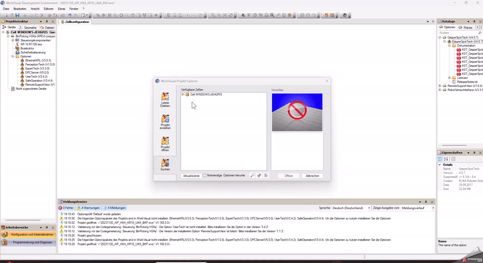
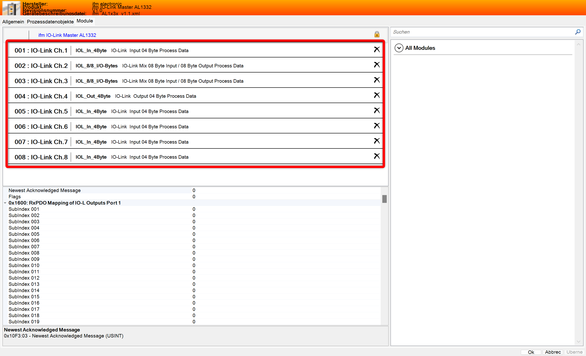

# WorkVisual

This sections provides a quick guide for the installation of WorkVisual as well as an overview of the project specific AIP WorkVisual project.

## I. How to install WorkVisual?

1. Download WorkVisual from the official KUKA website ([Link](https://kuka.sharefile.eu/share/view/seb15e6d0c9246e79/fofe824e-d661-457c-9858-97304df52369))
2. Install and run .exe 
3. Connect to the same subnet as the KUKA robot. For more information to the IPs, please check this [Link](/docs/devices_ips_and_passwords.md).

## II. Overview of the AIP WorkVisual project 

This sections provides an overview to the different components of the configured AIP WorkVisual project.
You will find the freezed project status in the corresponding MS Teams Team: 
**_IRAS Students/Projects/.-Automated_Item_Picking_**

## Configuration of PLC communication 

To set up the communication between robot control and the PLC, the EtherCAT communication interface needs to be implemented into the bus structure. The bus structure can be opened by double-clicking on the shown control (BinPicking HSKa (KRC4 compact - 8.5.5)). The necessary components are added to the KUKA Extension Bus (SYS-X44). 
The module KRC4 primary EL6695-1001 can be added after importing the corresponding ESI device description. Check the documentation file "KR_C4_EtherCAT_Bridge_FSoE_Master_Master_de" on MS Teams to set up the configuration of the communication  
Additionally, the ifm IO-Link Master AL1332 is added to the bus structure. Here also the ESI device description must be imported previously. 
For the configuration of the IO-Link master, in the tab "Modules" the following Bytes are assigned to the channels.  
 

## Configuration of the peripheral field modules

To link the peripheral field modules with this robot control, the in- and outputs need to be mapped. Follow the instructions in the KUKA documentation "AL1x3x_Kuka_Rev1_EN" in the "KUKA Startup Package" on MS Teams.

