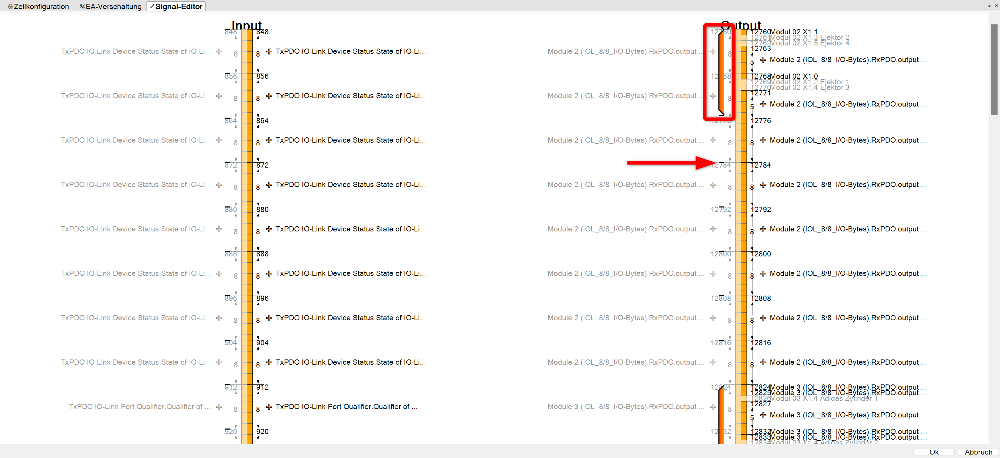

# How to configure WorkVisual

This sections provides a quick guide for the installation of WorkVisual as well as an overview of the project specific AIP WorkVisual project.

## I. How to install WorkVisual

1. Download WorkVisual from the official [KUKA website](https://kuka.sharefile.eu/share/view/seb15e6d0c9246e79/fofe824e-d661-457c-9858-97304df52369)
2. Install and run .exe
3. Connect to the same subnet as the KUKA robot. For more information to the IPs, please check this [Link](/docs/devices_ips_and_passwords.md).

    

## II. Overview of the AIP WorkVisual project

This sections provides an overview to the different components of the configured AIP WorkVisual project.
You will find the freezed project status in the corresponding MS Teams Team: 
[**_IRAS Students/General/01-IRAS_Wiki/2-Projects/2.1-Automated_Item_Picking/10_KUKA_WoV/20231130_AIP_KUKA_WoV_Project_**](https://hskarlsruhede.sharepoint.com/:f:/s/Robolab/Esc6STswNCFPnDBuxPwZ8QoBDzZO1w3VhKvccdllRSFXeQ?e=HVxMI5)

### Configuration of PLC communication

To set up the communication between robot control and the PLC, the EtherCAT communication interface needs to be implemented into the bus structure. The bus structure can be opened by double-clicking on the shown control (BinPicking HSKa (KRC4 compact - 8.5.5)). The necessary components are added to the KUKA Extension Bus (SYS-X44).

The module KRC4 primary EL6695-1001 can be added after importing the corresponding ESI device description. Check the documentation file "[KR_C4_EtherCAT_Bridge_FSoE_Master_Master_de](https://hskarlsruhede.sharepoint.com/:b:/s/Robolab/ERaAqqeBoAlDmdOa107Vn4sBQ-b2PggPapm9U5mhru5Jdw?e=lmfSFb)" on MS Teams to set up the configuration of the communication.

Additionally, the ifm IO-Link Master AL1332 is added to the bus structure. Here also the ESI device description must be imported previously.
For the configuration of the IO-Link master, in the tab "Modules" the following Bytes are assigned to the channels.


### Configuration of the peripheral field modules

To link the peripheral field modules with this robot control, the in- and outputs need to be mapped. Follow the instructions in the KUKA documentation "[AL1x3x_Kuka_Rev1_EN](https://hskarlsruhede.sharepoint.com/:p:/s/Robolab/EQevFUJAQKxMmUt3gQI4bckB9NjO45v9MAqVVceTXfnIew?e=DgMFya)" in the KUKA Startup Package on MS Teams.

Open the tab "E/A Mapping" and choose the marked settings shown below in the image. By doing this the in- and outputs of the field modules can be mapped to the KR C robot control.


Right-click on the in- or output you want to map in the left and right lower boxes. Not-mapped I/Os are marked grey. By clicking on the symbol on the bottom between the boxes the variables are mapped. Afterwards it appears in the upper box. The module number represents the port/channel number on the IO-Link master.

By clicking on the pen in the bottom right corner, the signal editor can be opened. Here the previously mapped in- and outputs are shown, broken down on bit level. The names of the variables can be adapted in this view.



The byteorder indicates how the single Bytes are stored in the controller memory. IO-Link uses a different byte order than the KUKA control. As soon as the amount of data is greater than 1 bit (e.g. byte), the signals must be swapped so that they are processed in the correct order. Swapped bytes are marked, like the red square in the picture above shows. You can swap bytes by dragging the dash, marked with the arrow. You need to swap at least one byte.

The number of bytes and bits used must also be adjusted. For example, reed contacts only use one bit, while the measured value of the pressure sensor is transferred with one byte. Additionally, the pressure sensor also uses individual bits. The number of bits can be adjusted by dragging the line on the right-hand side. The information on how the modules are integrated can be found in the data sheets.

Once the inputs and outputs have been integrated, they still need to be created in the KUKA Smartpad. To do this, the "Long text editor" must be selected in the "Editors" tab in WorkVisual. The variable name can be entered here in the previously assigned position. Once the programm has been uploaded to the controller, the created variables are visible and can be read or controlled.
Below you can find an example of the long text editor for the digital outputs below.


Below you can find a picture of all mapped inputs and outputs.


### Required Ethernet KRL Interface (EKI) files

EKI is used to exchange data between a KUKA robot controller and an external system. EthernetKRL is an optional software package that makes it possible to send and receive XML or binary data via the TCP/IP or UDP/IP protocol. This can be useful when connecting or controlling a robot with other devices or applications.

EKI offers the following options:

- You can set up and customise an Ethernet connection using an XML-based configuration file.
- You can send and receive data in various formats, such as freely configurable XML structures, binary data with fixed or variable length or direct strings.
- You can configure the robot controller and the external system as a client or server and operate up to 16 active connections simultaneously.
- You can signal events such as a successful connection, the receipt of a specific element or a complete data set by setting an output or a flag.
- You can use error handling and diagnostic functions to monitor and correct data transmission.

To use EthernetKRL, the software package must first be installed on the robot controller. You can read about this in chapter 4 of the [KUKA EKI documentation](https://hskarlsruhede.sharepoint.com/:b:/s/Robolab/ET_KrUUq_xJKnf7MTesLJNUBsFdrSCsVxshHmyi3J7YznA?e=GNgcrq) on MS Teams. The network connection must also be set up via the KLI interface of the robot controller, as described in chapter 5. Next, one or more Ethernet connections must be configured via an XML file, which must be saved in the robot controller's _C:\KRC\ROBOTER\Config\User\Common\EthernetKRL_ directory.

The EKI file _"EkiIOInterface.xml"_ is used in this project, as shown in the following structure tree.


The connection parameters such as the IP address, the port, the protocol type, the client-server mode and the buffer size must be specified in the XML file. In addition, the structure of the data to be sent and received must be defined by specifying the names, types and sizes of the elements. Events, end strings, access methods and other options can also be configured. In chapter 6 of the document you will find a detailed description of the XML structure and some examples of different data formats.

The most important components of the EKI files used can be described as follows:

| Section                              | Description                                                       |
|--------------------------------------|-------------------------------------------------------------------|
| `<CONFIGURATION>...</CONFIGURATION>` | Configuration of connection parameters between an external system and interface |
| `<EXTERNAL>...</EXTERNAL>`           | Settings for external system                                      |
| `<INTERNAL>...</INTERNAL>`           | Settings for internal system                                      |
| `<RECEIVE>...</RECEIVE>`             | Configuration of reception structure received by robot controller |
| `<SEND>...</SEND>`                   | Configuration of transmission structure sent by robot controller  |

Finally, a KRL programme must be written to control the data transfer. The Ethernet connection can be initialised with the **EKI_Init()** function and opened with the **EKI_Open()** function. Data can be sent and received with the **EKI_Send()** and **EKI_Get...()** functions. The Ethernet connection can be closed with the **EKI_Close()** function and deleted with the **EKI_Clear()** function. The **EKI_Check()** function can be used to check and handle errors. Chapter 7 of the document contains some programme examples for various use cases.

The KRL programme used can be described as follows:

- ```shell
    DEF kuka_eki_hw()
    ```

    Several variables are declared that are used for control and communication with the hardware.

    The function initialises the robot's axes and starts the EKI hardware interface server and the IO hardware interface server. These servers enable communication between external devices and the robot controller via the Ethernet network.

    A block coincidence movement is executed to bring the robot into its current position before the actual control loop begins.

    In a loop, data is periodically retrieved from the EKI hardware interface to receive new commands for the robot movement. When a new command is received, the robot is moved accordingly.

    Similarly, IO events are periodically retrieved and processed accordingly to control the robot's inputs and outputs.

    The loop runs indefinitely, which means that the function continuously waits for new commands and events and reacts accordingly.  

- ```shell
    def eki_hw_iface_init()
    ```

    teasfada

- ```shell
    def eki_io_iface_init()
    ```

    asdasd

- ```shell
    def eki_io_iface_send()
    ```

    asdasd

- ```shell
    def eki_hw_iface_send()
    ```

    asdasd

- ```shell
    deffct int eki_hw_iface_available()
    ```

    asdasd

- ```shell
    deffct int eki_hw_iface_get(joint_pos_cmd :out)
    ```

    asdasd

- ```shell
    deffct int eki_io_iface_get()
    ```

    asdasd

- ```shell
    def set_io_values()
    ```

    asdasd

- ```shell
    def eki_hw_iface_reset()
    ```

    asdasd

- ```shell
    def eki_io_iface_reset()
    ```

    asdasd