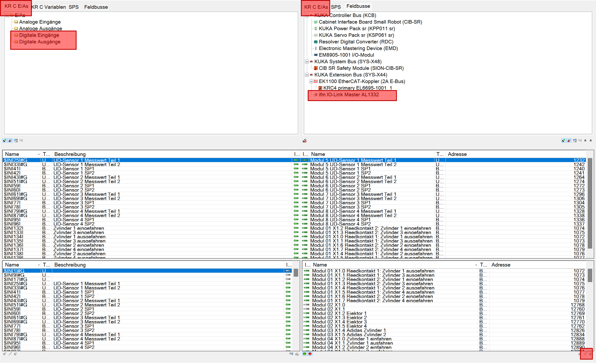

# WorkVisual

This sections provides a quick guide for the installation of WorkVisual as well as an overview of the project specific AIP WorkVisual project.

## I. How to install WorkVisual?

1. Download WorkVisual from the official [KUKA website](https://kuka.sharefile.eu/share/view/seb15e6d0c9246e79/fofe824e-d661-457c-9858-97304df52369)
2. Install and run .exe
3. Connect to the same subnet as the KUKA robot. For more information to the IPs, please check this [Link](/docs/devices_ips_and_passwords.md).

    

## II. Overview of the AIP WorkVisual project

This sections provides an overview to the different components of the configured AIP WorkVisual project.
You will find the freezed project status in the corresponding MS Teams Team: 
[**_IRAS Students/General/01-IRAS_Wiki/2-Projects/2.1-Automated_Item_Picking/10_KUKA_WoV/20231130_AIP_KUKA_WoV_Project_**](https://hskarlsruhede.sharepoint.com/:f:/s/Robolab/Esc6STswNCFPnDBuxPwZ8QoBDzZO1w3VhKvccdllRSFXeQ?e=HVxMI5)

### Configuration of PLC communication

To set up the communication between robot control and the PLC, the EtherCAT communication interface needs to be implemented into the bus structure. The bus structure can be opened by double-clicking on the shown control (BinPicking HSKa (KRC4 compact - 8.5.5)). The necessary components are added to the KUKA Extension Bus (SYS-X44).

The module KRC4 primary EL6695-1001 can be added after importing the corresponding ESI device description. Check the documentation file "[KR_C4_EtherCAT_Bridge_FSoE_Master_Master_de](https://hskarlsruhede.sharepoint.com/:b:/s/Robolab/ERaAqqeBoAlDmdOa107Vn4sBQ-b2PggPapm9U5mhru5Jdw?e=lmfSFb)" on MS Teams to set up the configuration of the communication.

Additionally, the ifm IO-Link Master AL1332 is added to the bus structure. Here also the ESI device description must be imported previously.
For the configuration of the IO-Link master, in the tab "Modules" the following Bytes are assigned to the channels.

### Configuration of the peripheral field modules

To link the peripheral field modules with this robot control, the in- and outputs need to be mapped. Follow the instructions in the KUKA documentation "[AL1x3x_Kuka_Rev1_EN](https://hskarlsruhede.sharepoint.com/:p:/s/Robolab/EQevFUJAQKxMmUt3gQI4bckB9NjO45v9MAqVVceTXfnIew?e=DgMFya)" in the KUKA Startup Package on MS Teams.

Open the tab "E/A Mapping" and choose the marked settings shown below in the image. By doing this the in- and outputs of the field modules can be mapped to the KR C robot control.

Right-click on the in- or output you want to map in the left and right lower boxes. Not-mapped I/Os are marked grey. By clicking on the symbol on the bottom between the boxes the variables are mapped. Afterwards it appears in the upper box. The module number represents the port/channel number on the IO-Link master.

By clicking on the pen in the bottom right corner, the signal editor can be opened. Here the previously mapped in- and outputs are shown, broken down on bit level. The names of the variables can be adapted in this view.

The byteorder indicates how the single Bytes are stored in the controller memory. IO-Link uses a different byte order than the KUKA control. As soon as the amount of data is greater than 1 bit (e.g. byte), the signals must be swapped so that they are processed in the correct order. Swapped bytes are marked, like the red square in the picture above shows. You can swap bytes by dragging the dash, marked with the arrow. You need to swap at least one byte.

The number of bytes and bits used must also be adjusted. For example, reed contacts only use one bit, while the measured value of the pressure sensor is transferred with one byte. Additionally, the pressure sensor also uses individual bits. The number of bits can be adjusted by dragging the line on the right-hand side. The information on how the modules are integrated can be found in the data sheets.

Once the inputs and outputs have been integrated, they still need to be created in the KUKA Smartpad. To do this, the "Long text editor" must be selected in the "Editors" tab in WorkVisual. The variable name can be entered here in the previously assigned position. Once the programm has been uploaded to the controller, the created variables are visible and can be read or controlled.
Below you can find an example of the long text editor for the digital outputs below.

Below you can find a picture of all mapped inputs and outputs.

