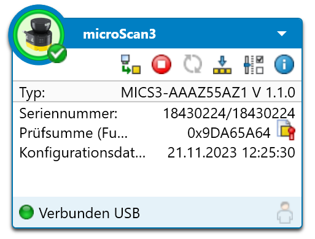
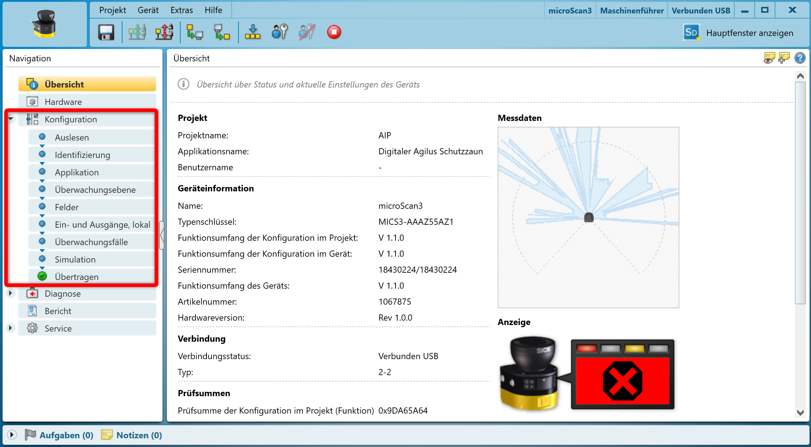
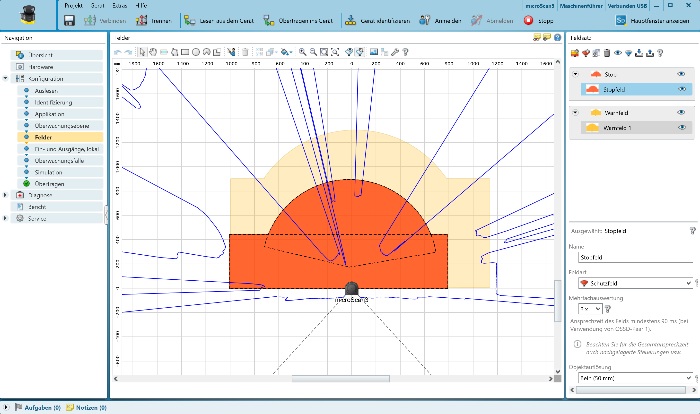
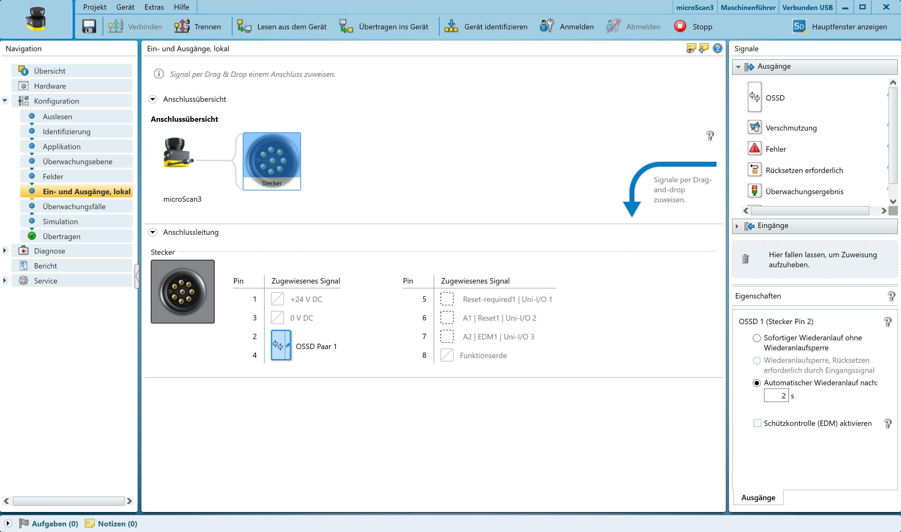
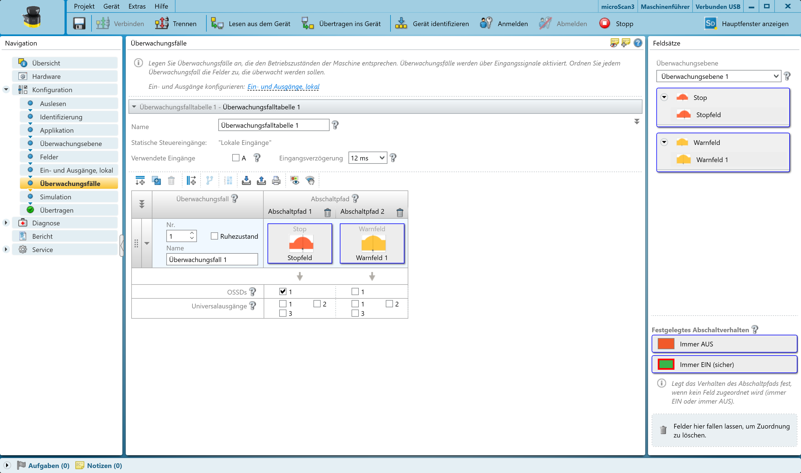

# How to configure Sick Scanner MicroScan3 Core I/O
## Hardware

The scanner operates on a 24V power supply, while its signals, known as OSSDA and OSSDB, are redundantly connected to the PLC. These signals interface with two distinct channels of the PLC module EL1904. The scanner is equipped with additional universal inputs and outputs. These can be optionally configured.

## Software

The scanner is configured with the configuration tool "[Safety Designer](https://www.sick.com/de/en/catalog/products/safety/safety-controllers/safety-designer/c/g575306?tab=overview)". In the following the most important steps of Safety Designer are explained. The tool is very intuitive.

- After the software is installed, open it and connect your computer via USB with the scanner. Search for the connected scanner.
- Choose the scanner to open the **configuration**.

     

- In the tab "**Configuration**" the settings of the scanner can be adjusted.

     

- Choose "**Fields**" to configure the warning and stop field of the scanner.

     

- Choose "**In- and Outputs, local**" to assign a funtion to a pin of the scanner.

     

- Choose "**Monitoring cases**" to create or adapt a monitoring case. Pins can be assigned to the stop or warning field.

     

- Save your changes and load it to the scanner.
