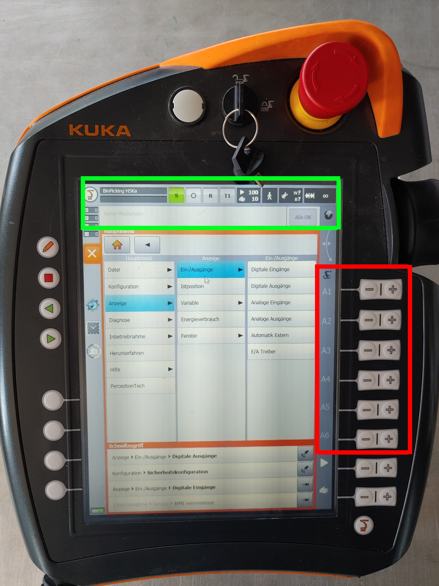
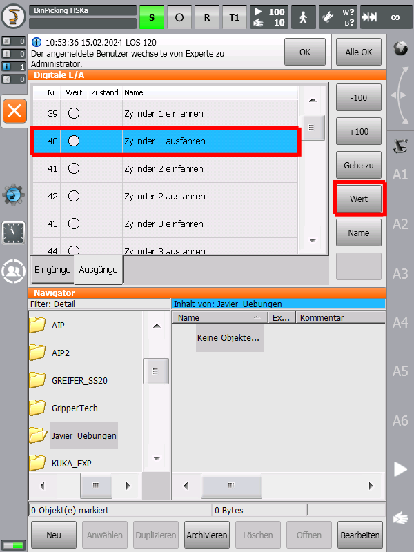
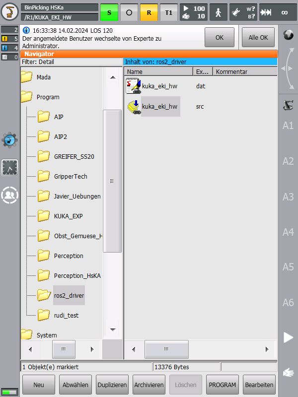
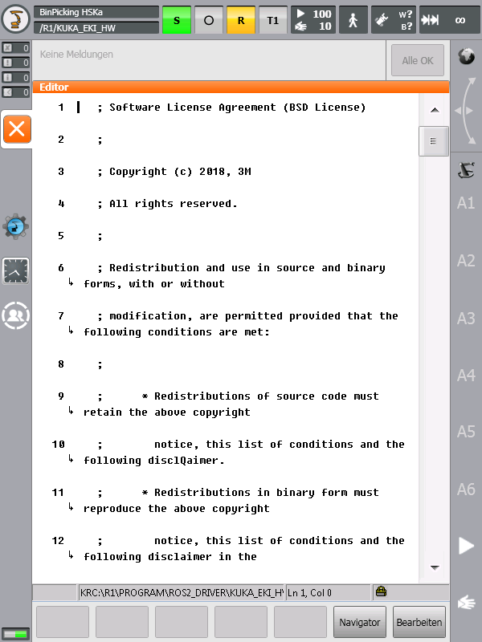

# How to start the AIP application

This sections provides a quick guide to start the AIP application. It enables you to run the complete AIP system and engineer your extended application.

For more information, please also review the corresponding AIP MS Teams Team:
[**_IRAS Students/General/01-IRAS_Wiki/2-Projects/2.1-Automated_Item_Picking_**](https://hskarlsruhede.sharepoint.com/:f:/s/Robolab/EqgV9DKqqRJDrYVzu5INeNgBFf0JPXn-Eccabwk7Z6qXew?e=N3B4xT)

## I. Quick start guide

1. Plug in the cabinet and power all devices
2. Check the PLC status
3. Check the KUKA SmartPad status
4. Start your docker environment on the laboratory PC

Notes:

- _The ejectors switch while the PLC is starting up. If there is compressed air in the system at the same time, this leads to a loss of pressure and a noticeable noise. However, this is not dramatic. As soon as the PLC has started up, the ejectors are set to their normal state and the pressure loss ends._

  _To prevent this behaviour, the air supply on the Festo maintenance unit can be closed._
- _If the PLC is not starting properly, the 7 days trial license may be outdated. To verify, please open the electrical cabinet and check if the PLC is in run mode (green light) or in configuration mode (blue light). If the blue light is on, this can be an license issue. For a quick solution, please check the assigned [trouble shooting](/docs/troubleshooting.md) of this repository._
- _To use the system after it has been switched on, the blue button on the control panel must be pressed. This does not light up at the beginning. Then the safety release has then been given and the robot can be used._
  
## II. Different movement options

There are 4 different options to operate the AIP application which will be described in the following subchapters.

### Manual mode via the KUKA SmartPad

1. Switch to user group _Administrator_ on smartHMI (pw: kuka)
2. Make sure to clean all errors, shown in green rectangle in the picture below
3. If the error "NOT-Halt nur lokal" occurs and red LED on the PLC CPU is blinking, probably the PLC is not in RUN mode.
4. Make sure that the drives are switched on
5. Make sure to set KUKA KR 10 into T1 mode
6. Push the enabling switch of the SmartPad while moving an axis with the buttons, marked with the red rectangle in the picture below, or the 6D mouse.

    

### How to operate the Gripper

To read or control sensors or actuators, select in the main menu the "_Display_" tab and then "_Inputs/Outputs_". Either the _digital inputs_ or _outputs_ can then be selected. The status of the inputs can be read out directly. To switch an actuator, it must first be selected and then switched by pressing the "_Value_" button while pressing the enabling switch.

1. To read or control sensors or actuators, select in the main menu the "_Display_" tab and then "_Inputs/Outputs_". Either the _digital inputs_ or _outputs_ can then be selected. The status of the inputs can be read out directly. To switch an actuator, it must first be selected and then switched by pressing the "_Value_" button while pressing the enabling switch.

   

For further information please see the KUKA **_ready2_educate_** documentation.

### How to set robot in EKI mode in order to listen to Linux-PC

  1. Switch to user group Administrator on SmartPad
  2. Activate project "ros2_driver" on SmartPad, if not already active
      - Open project management window (Blue WorkVisual icon, gear with robot inside)
      - Select "ros2_driver" in Verfügbare Projekte → Entpinnen
      - "Aktivieren" → Ja
      - Wait until project is activated
  3. On SmaprtPad navigate to R1 → Program → ros2_driver
  4. Load the file "kuka_eki_hw"
  5. Click on "Abwählen" to deactivate the current programm
  6. Click on "Anwählen" to activate the "kuka_eki_hw"

      

  7. Execute the programm
  8. During the execution you can see the following code:

      

### Automatic modus via EKI (RViz)

Further information for this operating mode can be found in the corresponding repository: [IRAS-HKA/aip_bringup](https://github.com/IRAS-HKA/aip_bringup.git). Especially, the ReadMe provides detailed information regarding the start up.

1. Prerequisite: Docker and connection to robot is up and running
      - Clone and build repository "[AIP Bringup](https://github.com/IRAS-HKA/aip_bringup.git)"
      - Open a terminal (Ctrl + Alt + T) and navigate to project folders

        ```shell
        mkdir -p ~/projects && cd ~/projects
        ```

      - Clone repository, if not already cloned. Log in with your RZ account.

        ```shell
        git clone -b dev https://www.w.hs-karlsruhe.de/gitlab/iras/common/instructions/iras_robots/aip_bringup.git
        ```

      - Navigate to cloned repository

        ```shell
        cd aip_bringup
        ```

      - Build container

        ```shell
        ./start_docker.sh
        ```

        If everything went well, you should be in the container like this:

        `robot@IRAS-IRL0-LIN:~/ros_ws$`

      - Set ROS_DOMAIN_ID. If there are multiple robots in use, make sure, that the set ROS_DOMAIN_ID is different on each PC

        ```shell
        export ROS_DOMAIN_ID=<id>
        ```

      - You can check your currently set ROS_DOMAIN_ID by running

        ```shell
        echo $ROS_DOMAIN_ID
        ```

      - In the container, build workspace:

        ```shell
        colcon build
        ```

      - Source workspace

        ```shell
        source install/setup.bash
        ```

2. Start launch file

    - Execute the still running container

        ```bash
        docker exec -it aip_bringup bash
        ```

    - As you have opened a new terminal, you need to set your ROS_DOMAIN_ID again, use the same ID as before

        ```bash
        export ROS_DOMAIN_ID=<id>
        ```

    - You can check your currently set ROS_DOMAIN_ID by running

        ```bash
        echo $ROS_DOMAIN_ID
        ```

    - Source workspace

        ```bash
        source install/setup.bash
        ```

    - Launch robot driver with MoveIt2 wrapper

        ```bash
        ros2 launch kuka_kr3_cell_description cell.launch.py
        ```

        This will open up a simulated hardware with visualisation.
        To launch the real robot:
        - Make sure that you are in the local network (Wi-Fi or LAN)
        - Test your application in simulation first
        - Make sure that the robot is not in a collision state when the application is executed on the real robot
        - If everything is fine, execute

          ```bash
          ros2 launch kuka_kr3_cell_description cell.launch.py use_fake_hardware:=false robot_ip:=<robot-ip>
          ```

3. Check out tutorial code

   - Please check out the repository [IRAS-HKA/aip_bringup](https://github.com/IRAS-HKA/aip_bringup.git), if you haven´t already.

4. Start ROS environment

   - Open up a new terminal and attach to running container

        ```bash
        docker exec -it r2e_cell /bin/bash
        ```

   - If you have opened a new terminal you need to set your ROS_DOMAIN_ID again, use the same ID as before

        ```bash
        export ROS_DOMAIN_ID=<id>
        ```

   - You can check your currently set ROS_DOMAIN_ID by running

        ```bash
        echo $ROS_DOMAIN_ID
        ```

   - Source workspace

        ```bash
        source install/setup.bash
        ```

   - Run same application
        - Before running the application, check the robot's movement in the simulated environment and make sure, that the robot is not in a collision state when the application is executed on the real robot

        ```bash
        ros2 run r2e_demos test_ros_env
        ```

5. Move Robot via EKI and RViz

   - Start RViz in second terminal of your running docker container

      ```bash
      ros2 run rviz
      ```

   - Use mouse courser to drag robot to your desired position
   - Click "Plan" in order to plan the trajectory in the simulation
   - Click "Plan & Excecute" in order to move the robot and in the simulation

      **Pay attention**: If you´ve set the parameter use_fake_hardware:=false, the action will be executed on the real robot. Make sure that it won´t trigger a collision

### 3. Automatic modus via Behaviour Tree

The information for how to move the robot using a behavior tree are described in the repository [IRAS-HKA/aip_coordinator](https://github.com/IRAS-HKA/aip_coordinator.git).

The "IRAS Coordinator" package provides a starting point for high-level task control of the AIP robot application.

The library of actions can be freely arranged using the "Groot" graphical user interface. There are instructions on how to create and start the Docker container as well as instructions on how to start debugging.

Once the container is started, the description can be used to design a new or change the behavior tree in Groot.  
Furthermore, instructions are given on how to create a new custom node and how to create behavior trees.

### 4. Automatic modus via Python

1. Prerequisite: Docker and connection to robot is up and running
2. Connect with second terminal to existing docker session

    ```bash
    docker exec -it aip_bringup bash 
    ```

3. In the second terminal you can execute the following python scripts in order to move the robot basend on coordinates. Example python file.

    ```bash
    ros2 launch aip_cell_description aip.launch.py
    ```

## III. URDF Model

A URDF (Unified Robot Description Format) model is an XML file that is used to describe the kinematic and geometric structure of a robot. URDF is often used in robotics, especially in robot simulation environments such as ROS.

URDF typically defines the following aspects of a robot:

- **Joints**: The connections between the individual links of the robot that enable movement. These can be rotational or translational joints.
- **Links**: The rigid bodies of the robot that are connected by the joints.
- **Sensors**: Information about sensors such as cameras, lidar or tactile sensors can also be defined in the URDF.
- **Visualisation**: URDF can also contain the visual representation of the robot, e.g. by specifying mesh files or other graphic resources.

The files used are stored in [MS Teams](https://hskarlsruhede.sharepoint.com/:f:/s/Robolab/EvarfBdhJH5EiF5MisFpLRoBV33X3YFL95Ve3CYxm8kgdQ?e=Y4TLLa). To integrate or change files, new files must be stored in the following folder as an STL file.

    home/code/aip_bringup/dependencies/aip_cell_description/meshes/aip_cell/visual

To detect collisions, it is necessary to store the files also in the following folder:

    home/code/aip_bringup/dependencies/aip_cell_description/meshes/aip_cell/collision

These must then be included in the file _"aip_cell_macro.xacro"_ under the file path:

    home/code/aip_bringup/dependencies/aip_cell_description/aip_cell_description/urdf

The scaling factor and translational shifts are also defined in this file.

The model consists of 3 files, the table, the frame and the simulated ejectors on the robot. The model is best visualised in RViz.


# **=> ToDo**


# TODO

- [x] Add manual mode description
- [x] Add EKI/ RViz description
- [x] Extend manual mode description
- [ ] Add automatic modus behaviour tree description
