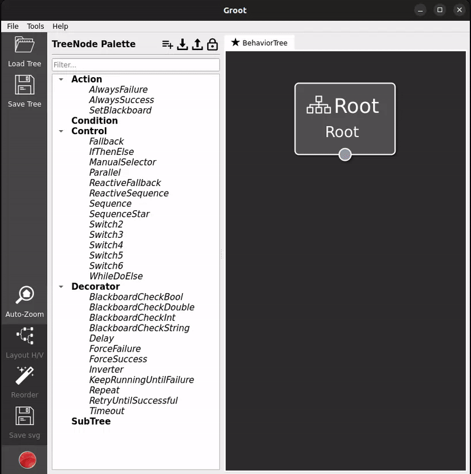
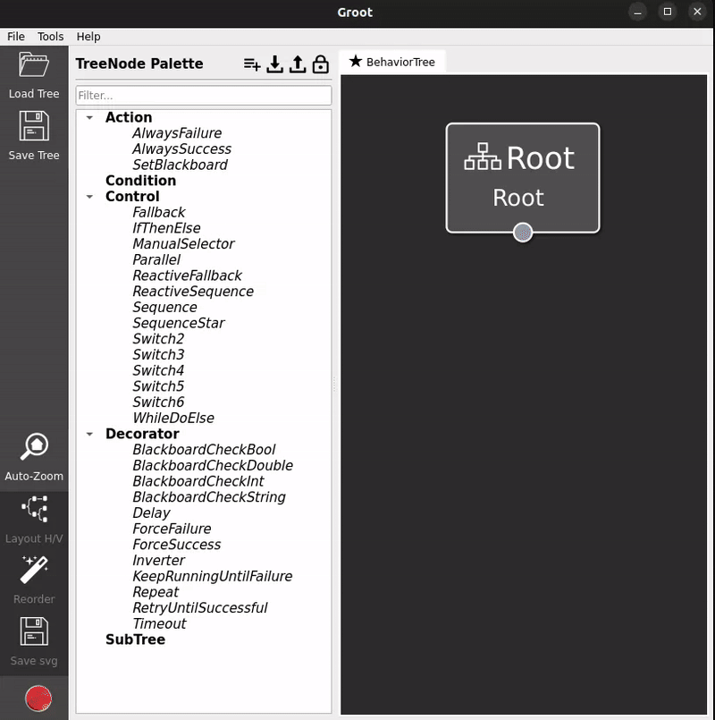

# How to use AIP Coordinator

This section provides an overview to the creation of a custom client (including a custom interface) and the workflow with behavior trees.

## I. Creation of a custom client

The functionality of the Bosch Gripper is represented by a ROS2 service client in C++ with a custom interface.

To learn more about ROS2 service clients in general, please investigate the following [link](https://docs.ros.org/en/foxy/Tutorials/Beginner-Client-Libraries/Writing-A-Simple-Cpp-Service-And-Client.html).

For further examples on the creation of custom nodes, please review the ReadMe of the [aip_coordinator](https://github.com/IRAS-HKA/aip_coordinator) repository.

### Custom interface

To set up a custom interface for the service definition, you need to the customize the different parts of a message in ROS2. This is done in the .srv files.
The file contains a part for the request and one for the response. They are separated by a `---` line.

To learn more about ROS2 custom interface messages in general, please investigate the following [link](https://docs.ros.org/en/crystal/Tutorials/Custom-ROS2-Interfaces.html).

In this example, it is located in the iras_interfaces package: `iras_interfaces/srv/<YourCustomInterface.srv>`

The service definition for movements of the gripper (MoveGripper.srv) is structured as follows:

```yaml
# Request
int32[] cylinder_ids # number of cylinders as written on the hardware
---
# Response
bool success # indicate successful run of triggered service 
string message # informational, e.g. for error messages 
```

To confirm that your interface creation worked, you can use:
```
ros2 srv show <your_package_name>/srv/>
```
A request requires an array of 32-bit integers with the numbers of the to be moved cylinders.
This array is further processed in the gripper.cpp file where the cylinder numbers are mapped to the corresponding to be triggered hardware pins.

### Header files

1. Add new header files e.g. OpenGripper.h and CloseGripper.h.
   - Note:
     - _To facilitate the creation of a new service node, please copy OpenGripper.h and rename it._
     - _To facilitate the creation of a new ActionNode, please copy MoveBase.h and rename it._
2. Include the header files of your ROS2 interface you want to use.
   - Note: _Interface header files are generated automatically. If your interface is called MoveGripper.srv (PascalCase), the generated header will automatically be move_gripper.hpp (snake_case)._
3. Give an alias as shorter name to optimize readability (using ...).
4. Replace all occurences where the old alias is used with the new one.

### Source files

1. Add new source files e.g. OpenGripper.cpp and CloseGripper.cpp.
   - Note:
     - _To facilitate the creation of a new service node, please copy OpenGripper.cpp and rename it._
     - _To facilitate the creation of a new ActionNode, please copy MoveBase.cpp and rename it._

2. Include your newly added header by changing the first line (#include line).
3. Replace all occurences where the old alias is used with the new one.
4. Replace all occurences of the old class name with the new one.
5. Set the topic name of the ros2 service/ action/... server to connect with as string,
6. Set the list of ports provided by the BT node.
   - InputPort represents a human input to the BT via Groot editor.
   - OutputPort represents an output from previous ROS2 processes to human via BT (Groot).
7. Set the content of the goal message which is sent to the ROS2 service/ action/... server.
8. Define what happens when receiving the result from the ROS2 action server.

### Coordinator node

The coordinator node is located at `aip_coordinator/src/node.cpp`

1. Include your newly created header files in the coordinator node.
2. Register your node in the BehaviorTreeFactory.
   - The inserted string defined the name of the node in the BehaviorTree XML representation and Groot visualization.
  
Example Code:

```c++
// Gripper
factory.registerNodeType<OpenGripper>("OpenGripper");
factory.registerNodeType<CloseGripper>("CloseGripper");
```

### Gripper.cpp

For more information, please review [aip_bosch_gripper](https://github.com/IRAS-HKA/aip_cell_description/tree/main/aip_bosch_gripper).


## II. Behavior Tree

There are two options to design a new behavior tree: Graphically via the groot editor or directly by a XML file.

### Option 1: Graphical Design via Groot

You can graphically design your desired sequence within the Groot Editor UI for the Behavior Tree.
 It will be automatically converted to a XML-file.

```bash
# To view or modify behavior trees, attach a new shell and start Groot
# To start the Editor mode, click "Editor" and "START"
ros2 run groot Groot
```

Note: _If the groot palette appears to be incomplete, please re-import the GrootPalette with all custom nodes. The XML-file is stored in:_
    `/home/docker/ros2_ws/src/aip_coordinator/behaviors/GrootPalette.xml`

Usually, the designed behavior trees are stored in the following location in the repository:
    `aip_coordinator/src/aip_coordinator/behaviors/examples`

### Option 2: Coding in XML

You can directly code your application sequence by creating a new .xml-file and adjusting the code.

#### Execute a behavior tree
  
To adjust the to be executed behavior tree, please navigate to the params.yaml file and adjust the main_tree_path:

```yaml
# in /home/docker/ros2_ws/src/aip_coordinator/config/params.yaml
main_tree_path: "/home/docker/ros2_ws/src/aip_coordinator/behaviors/<your_folder_name>/<your_tree_name>.xml"
```

Alternatively, you can create a new launch file with the following parameter:
```yaml
# in /home/docker/ros2_ws/src/aip_coordinator/launch/<your_launch_file>.launch.py>
parameters=[{'main_tree_path': "/home/docker/ros2_ws/src/aip_coordinator/behaviors/<your_folder_name>/<your_tree_name>.xml",
             'groot_palette_path': "/home/docker/ros2_ws/src/aip_coordinator/behaviors/GrootPalette.xml"}],
```

### Import the Groot Palette



This needs to be added every time, the trees are edited.

### Load Tree in Groot


