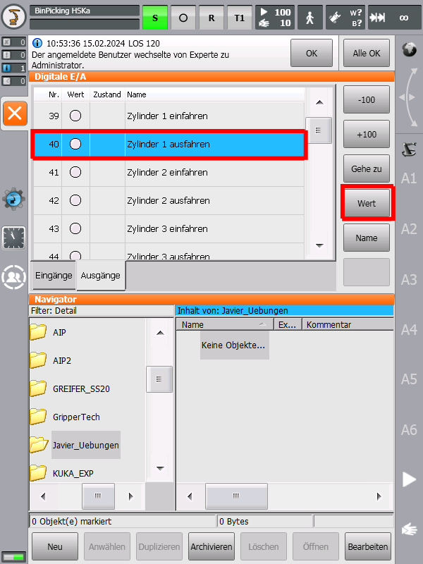
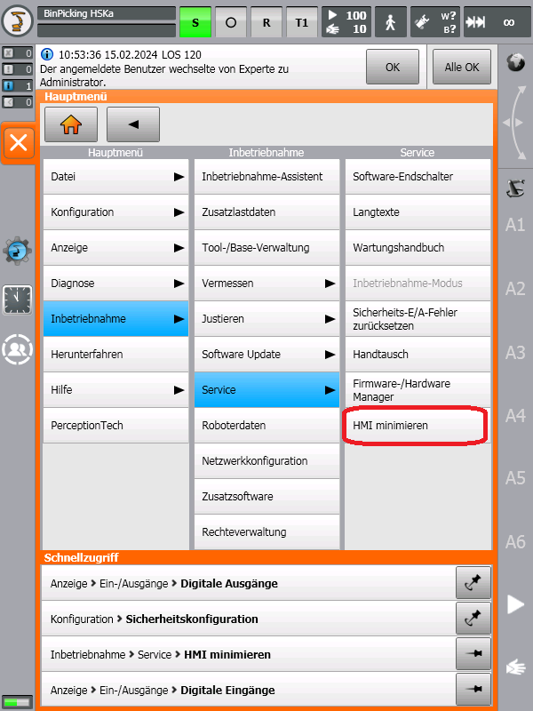

# Standard functionalities on the KUKA SmartPad

## How to move robot

1. Switch to user group _Administrator_ on smartHMI (PW: kuka)
2. Make sure to clean all errors, shown in green rectangle in the picture below
3. If the error "NOT-Halt nur lokal" occurs and red LED on the PLC CPU is blinking, probably the PLC is not in RUN mode.
4. Make sure that the drives are switched on
5. Make sure to set KUKA KR 10 into T1 mode
6. Push the enabling switch of the SmartPad while moving an axis with the buttons, marked with the red rectangle in the picture below, or the 6D mouse.
7. If you want to execute a programm, select it and press the "Start" button below the axis

    

## How to controll the gripper

1. To read or control sensors or actuators, select in the main menu the "_Display_" tab and then "_Inputs/Outputs_". Either the _digital inputs_ or _outputs_ can then be selected. The status of the inputs can be read out directly. To switch an actuator, it must first be selected and then switched by pressing the "_Value_" button while pressing the enabling switch.

   

For further information please see the KUKA **_ready2_educate_** documentation.
  
## Change of User Group

   

If options are marked in grey color, you can try using a different user group (PW: kuka).

## Change T1, T2 or Automatic Mode

Turn the key on the top of the panel in order to switch into the menu.

   

## Minimize HMI

Make sure you are logged in as "Administrator".

   

## How to install Additional Software?

You can select the software you want to install by using the correct .kop file.

   
