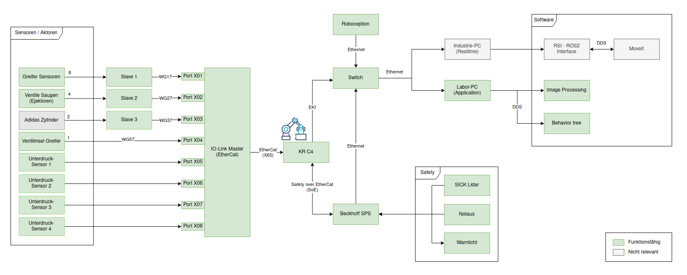
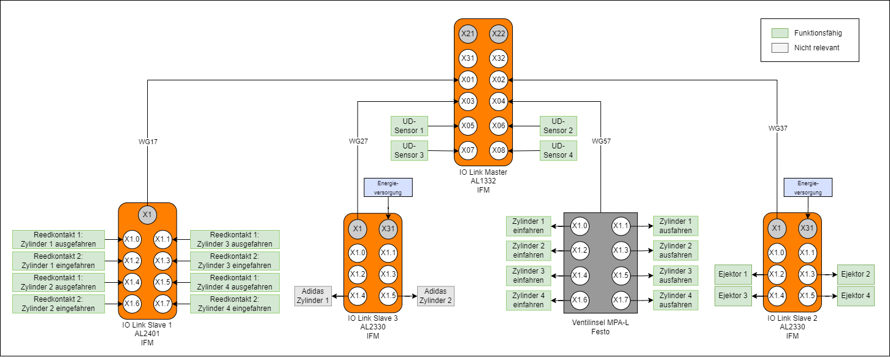

# System Overview

This section provides a general overview as well as a detailed IO-Link overview for the complete AIP application.

## General overview

Below, you will find a **general overview** for AIP:

Most important components are the following:

- Peripheral sensors and actuators are wired to the IO Link slaves.
- Slaves are wired to the IO-Link master.
- The master device is connected to the KUKA KR10 robot control.
- A configuration of the IO-Link system is done with the KUKA software WorkVisual.

- All network participants are connected to the same switch.

- A Beckhoff PLC is used to provide the safety-related aspects of the system.
- A Sick lidar scanner, an external emergency stop and a signal tower are wired to the PLC.
- The PLC is communicating with the robot control and provides the safety approval.

The robot can be controlled via the KUKA SmartPad or by starting a behavior tree on the computer.  
Alternatively RViz or pyhton can be used to move the robot to a specific pose.

## Detailed IO-Link wiring

Below, you will find a **detailed view of the IO-Link wiring**:

