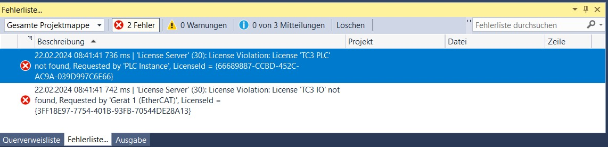
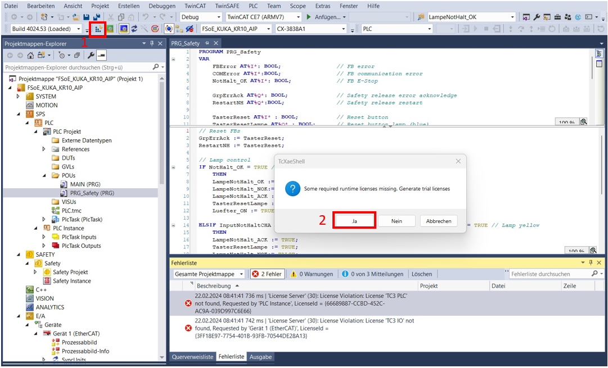
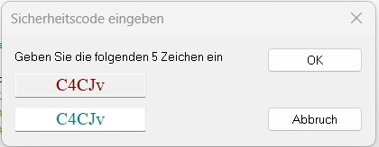
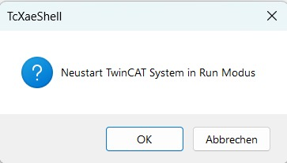

# Trouble shooting

This section provides a brief summary of various problems that have arisen as well as their solution.
This may help you with different kind of struggles while working with the AIP application.

## I.  PLC Device Manager not accessible

`PLC device manager is not accessible`

### Solution

- Reset PLC to factory settings
- PLC settings are available via "CER Host". Program is available in MS Teams folder _IRAS Students/Projects/.-Automated_Item_Picking_.

## II. EL 1904 Diag 2 (red) illuminating

`The Diag 2 LED illuminates red if the terminal detects an external supply or cross-circuit. The LED
extinguishes once the error is rectified.`

### Solution

- Check circuit wiring
- Check if correct safety configuration is loaded to PLC
- Check if correct device description file (ESI) for KRC4 EL6995-1001 is loaded

## III. PLC does not provide the necessary safety approval to KUKA KR C4

Possible errors:

`Programm is not loaded correctly to PLC`

`SD card is broken`

`PLC is not in RUN mode`

### Solution

- If the program is not loaded correctly, it is not possible to switch the PLC into "RUN" mode. Try to load the program again. The complete project is saved in AIP MS Teams Team.
- If the SD card is broken, simply copy the files to a new one. No flashing required.
- Set PLC to RUN mode if not active.

## IV. PLC debugging issues

`Various plc debugging issues`

- Connect PLC via display output to a monitor
- Install programm "**CER Host**" from the corresponding AIP MS Teams Team _IRAS Students/Projects/.-Automated_Item_Picking_ and access it over this tool.
- Access it over the web interface → PW required
- If nothing works: Take SD card to another PLC unit and try it there.

## V. Network communication issues

`Devices can´t establish communication in the network`

### Solution

- Check the cables and cable connections
- Verify that all devices are in the same subnet (e.g. 10.177.x.x)
- Log onto device to check if they are running / working (connection via ethernet / USB to PC)

## VI. IO-Link and KUKA KR C4 connection issues

`IO-Link and KUKA KR C4 connection issues`

### Solution

- Install KUKA WorkVisual and ifm Moneo and check the current configuration
- Reset ifm IO-Link Master using Moneo
- Check if devices are listed in the graphical overview in Workvisual. If not, import them and deploy the project to KUKA.

## VII. PLC start up issues "Not-Halt nur Lokal"

`PLC not properly starting up due to license issues`

If you´re trying to start the AIP application but the PLC doesn´t start up properly, this may be caused by an outdated PLC trial license.  
A trial license is only valid for 7 days but can be generated for free.

### Solution

- Connect your laptop/ PC (with TwinCAT) via LAN cable with the PLC
- Make sure that your route to the PLC ip is set up
- Open the latest valid PLC project in TwinCAT
- Try to restart the PLC in the run mode by clicking the green TwinCAT Symbol "Restart TwinCAT System" on the top left side of the application UI
- Most likely you will receive the following error messages:
  
  

- Try to load the valid configuration to the PLC again by clicking "Activate configuration" / "Konfiguration aktivieren" on the top left side of the application UI.

  It will ask you to if you would like to generate a trial license. Confirm this.
  
  

- Type in the requested type sequence

  

- Confirm the restart of the TwinCAT System in run mode
  
  

- This will generate a new 7 days free trial license and enables you to put the PLC back in run mode. If it doesn´t solve the issue, please check VIII below.

## VIII. PLC License Error - empty battery

`Invalid license for PLC`

If the battery of the PLC is empty, the date will be resetted after every restart to a date in the past. This triggers license errors preventing you to load the configuration to the physical modules. Free 7 days licenses are generated based on the current date and time of your PC.

### Solution

- Long term: Replace the battery of the PLC
- Short term:
  - Connect via LAN to PLC
  - Open the correct programme
  - Load the programme to PLC → This triggers the generation of a licence

If there are further issues, set the correct date and time manually in the online device manager.
