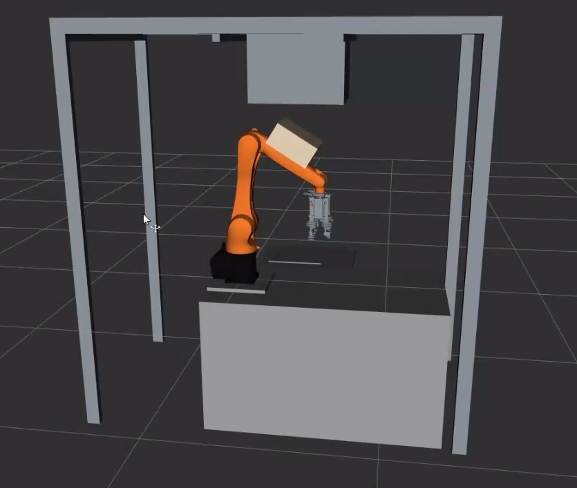

# URDF Model

A URDF (Unified Robot Description Format) model is an XML file that is used to describe the kinematic and geometric structure of a robot. URDF is often used in robotics, especially in robot simulation environments such as ROS.

URDF typically defines the following aspects of a robot:

- **Joints**: The connections between the individual links of the robot that enable movement. These can be rotational or translational joints.
- **Links**: The rigid bodies of the robot that are connected by the joints.
- **Sensors**: Information about sensors such as cameras, lidar or tactile sensors can also be defined in the URDF.
- **Visualisation**: URDF can also contain the visual representation of the robot, e.g. by specifying mesh files or other graphic resources.

For further information, check the [official ROS documentation](https://docs.ros.org/en/humble/Tutorials/Intermediate/URDF/URDF-Main.html).

The model consists of several files. Main components are the robot, the table, the frame and the simulated ejectors on the robot. The model is best visualised in RViz as shown below:

The used files are stored in [MS Teams](https://hskarlsruhede.sharepoint.com/:f:/s/Robolab/EvarfBdhJH5EiF5MisFpLRoBV33X3YFL95Ve3CYxm8kgdQ?e=Y4TLLa). The robot-STL is stored in the GitHub Repository. To integrate or change files, new files must be stored in the following folder as an STL file.

    /home/code/aip_bringup/dependencies/aip_cell_description/meshes/aip_cell/visual

To detect collisions, it is necessary to store the files also in the following folder:

    /home/code/aip_bringup/dependencies/aip_cell_description/meshes/aip_cell/collision

These must then be included in the file _"aip_cell_macro.xacro"_ under the file path. The scaling factor and translational shifts are also defined in this file. Also in this file, the link between the simulated ejectors and the robot is created.

    /home/code/aip_bringup/dependencies/aip_cell_description/aip_cell_description/urdf

In the file _"aip_kr10_cell.xacro"_ in the previous file path, the joint between the simulated ejectors and the robot is defined.

In the file _"aip_kr10_cell.srdf"_ in the following file path, the exceptions for collisions are defined. This is necessary because between the simulated ejetors and the robot, a "false" collsion is detected.

    /home/code/aip_bringup/dependencies/aip_cell_description/aip_cell_description/config
